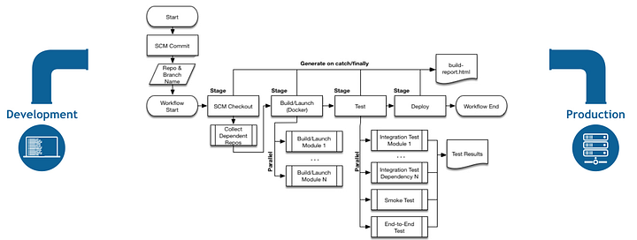

+++
author = "Veton Hajdari"
title = "CI/CD and Change Management for Pipelines — Part 1"
date = "2020-03-09"
tags = [
    "CDAP",
    "Google Cloud Platform",
    "Ci Cd Pipeline",
    "DevOps",
    "Continuous Integration",
]

aliases = ["ci-cd-change-management-for-pipelines-1"]
image = "photo-1.png"
type = "blog"
+++

Welcome to my latest series on continuous integration of data pipelines with Cloud Data Fusion (CDF) and/or CDAP. This will be a **4 part series** of articles where I’ll discuss the promotion process of data pipelines across multiple environments and all the tools and techniques that we’ll use along the way.

**Change Control and CI/CD**
----------------------------

Whenever we consider a development lifecycle in an enterprise setting there are a number of gates that a product has to go through before being released to production. Typically we do development in a segregated development environment, most often this is our very own laptop. Artifacts that have completed the development phase would be transferred to a test environment to undergo both unit and integration testing. Some organizations have a more rigorous Quality Assurance (QA) process that requires that all artifacts that pass initial tests undergo further testing in order to be certified for release to production. Finally, all artifacts that have been tagged for promotion will be published to a production environment and put to use with production data and secured accordingly.

There are two parts to this equation; governance and automation. Some or all of these activities can be automated with platforms like [GitHub](https://github.com/) and similar systems, others require implicit human intervention. The governance process for developing and promoting code to production is now commonplace and very well understood by enterprises, but how does this apply to data integration pipelines that are not necessarily code?

If we come from the programming world we most likely have been exposed to [Version Control Systems](https://en.wikipedia.org/wiki/Version_control) like [Git](https://git-scm.com/). To automate the process of migrating artifacts from Git most enterprises leverage CI/CD tools like [Jenkins](https://jenkins.io/) or [Travis CI](https://travis-ci.com/). The human element in the governance process for change control becomes a simple workflow in GitHub, as in reviewing and merging a PR, but scheduling and prioritizing promotion of artifacts may still require approval and scheduling by committee.

In this article I’m not going to focus so much on the change control process and all the bureaucracy that may go with it, but I’ll primarily discuss the mechanics of how a CI/CD workflow can be implemented for developing and promoting CDF/CDAP artifacts from development through production.

CI/CD has many moving parts so I’ll break this topic down into multiple articles to focus on each area in greater detail as we go through this journey. The series of articles will be broken down as follow:

*   In this first article we’ll cover the overall process and define the concepts.
*   In the second article we’ll focus on how we can extract artifacts from a CDF/CDAP environment and store them on GitHub.
*   In the third article we’ll discuss the process for migrating artifacts from GitHub into a TEST, QA, or PROD environment.
*   And finally, in the fourth article I’ll discuss how we can automate the whole process so that we can invoke the whole CI/CD process with Jenkins.

**What is CI/CD?**
------------------

Often you will see the acronym CI/CD in reference to software development workflows. This stands for Continuous Integration and Continuous Development or Deployment. In simple terms this means we write some code and some tests for that code, and some automation system takes over once we’ve checked in our code to build it, run the unit and integration tests that were written, and deploy the resulting artifacts somewhere.

So why is CI/CD important? As you can imagine, most enterprises will have distributed teams working on different portions of a system that supports production goals, therefore automation for continuously building and delivering new features and functionality, as well as bug fixes, is highly valued. This also allows teams to be more agile and work on multiple tasks simultaneously.

Most important of all is that only artifacts that have been fully tested and validated make their way into production. CI/CD processes, and systems that enable those processes, are widely used to achieve this goal.

In the context of developing pipelines we don’t really have a build process as in the traditional sense of compiling code. The development process itself is defining the logical flow and processing steps for the data pipeline using a visual development environment, and testing will typically happen in preview mode while in the pipeline development studio of CDF/CDAP. Further testing is then conducted by publishing the pipeline in a development environment that most likely has only a subset of data. Asserting the validity of the test requires that sources and sinks are checked for the expected number of records, and this can change based on which environment the tests are run on and the volume of data.

From an automation perspective we would look at leveraging the REST API of CDF/CDAP to deploy repeatable sets of tests along with preparing the execution environment.

**Organizing Artifacts Into Namespaces**
----------------------------------------

One powerful feature of CDF/CDAP is that you can organize your artifacts into separate namespaces. Each namespace can have its own artifacts; including pipelines, plugins and applications, as well as its own preferences, a set of key value pairs that can store information for things like database connections or folder paths.

As an example you can have a DEV namespace that may be configured to point to a development database and a TEST namespace that would point to an entirely different database. Using this technique it makes it easy to test your promotion process without having to maintain multiple CDF/CDAP instances.

**Segregated CDF/CDAP Instances**
---------------------------------

At times it is absolutely essential that a production environment is segregated into its own distinct set of instances with security and networking configured specifically for that purpose.

Oftentimes this means having a dedicated VPC and strict network ingress and egress rules, as well as very restrictive service accounts and user account controls.

In this context, CDF/CDAP may be just one component of a greater ecosystem of data storage and processing systems, and thus would need to be highly secured and would be required to work in a very restrictive environment. To effectively test such environments it would be necessary to have a similarly configured QA environment that mimics the same properties of the production environment such that the integrated tests will be representative of the workloads that would be experienced in production.

**Testing a Pipeline**
----------------------

When developing a pipeline locally in CDAP Sandbox you can test the pipeline in preview mode, and when you are ready to test with real datasets you can publish the pipeline and run it locally. This is an effective way to test that the pipeline logic is working well, but this only tests the pipeline with a limited scope of data, and without true parallelism. To test the pipeline at scale you really need to deploy and test it at scale using an Apache Hadoop cluster like Dataproc and a sufficiently large input.

For quick tests across environments you will need to make sure that you have the following elements replicated to the target environment where you intend to do the testing:

*   **Source Data** — This data should be in a storage system reasonably equivalent to production, and be large enough to simulate your desired levels of scalability. We will use datasets from HDFS or GCS in CSV or Avro format for the purpose of this blog series.
*   **Pipeline** — The JSON export of the pipeline DAG.
*   **Plugins** — If you have any custom developed plugins or plugins you’ve downloaded from the hub.
*   **Preferences** — Key value pairs used in that namespace for macro substitution.

CDAP provides three ways to export a pipeline. You can export a pipeline directly from within the UI, via the CLI, or by using the API. I’ll show you two ways to export a pipeline that include the UI and the API. But, keep in mind that environment specific configurations like preferences and deployed applications are not part of the pipeline export — more on this in the next article.

**Part 1 — Wrap Up**
--------------------

In the next article I will cover the following:

*   Creating a checklist of all the artifacts you will need to test in a target environment
*   How to set up a GitHub project to house our pipeline artifacts
*   How to export pipelines from CDF/CDAP using the export tools in the UI and how to do it via the ReST API
*   How to check in our development pipelines to GitHub
*   How to deploy a pipeline to an alternate environment using both the UI and the ReST API

See you next time!