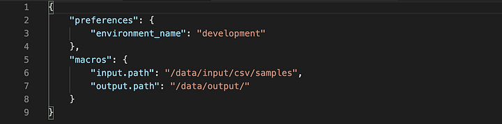
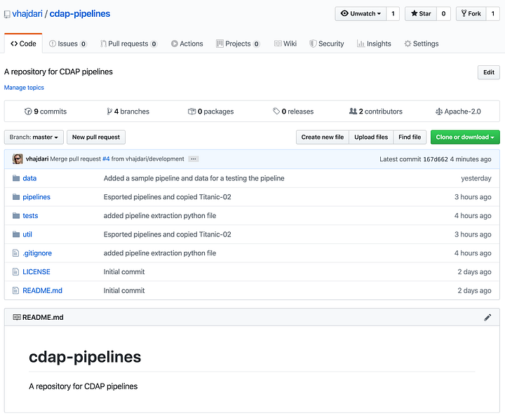
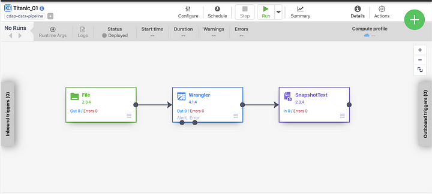
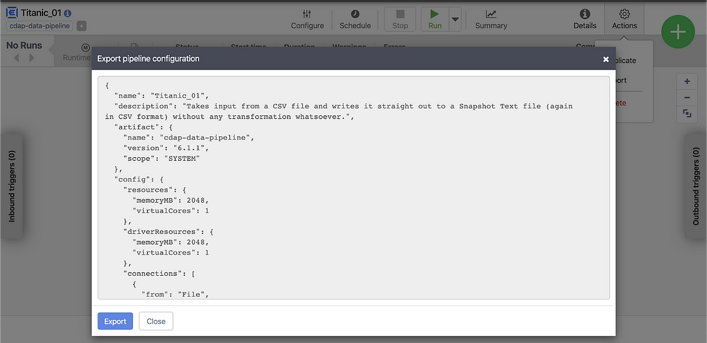
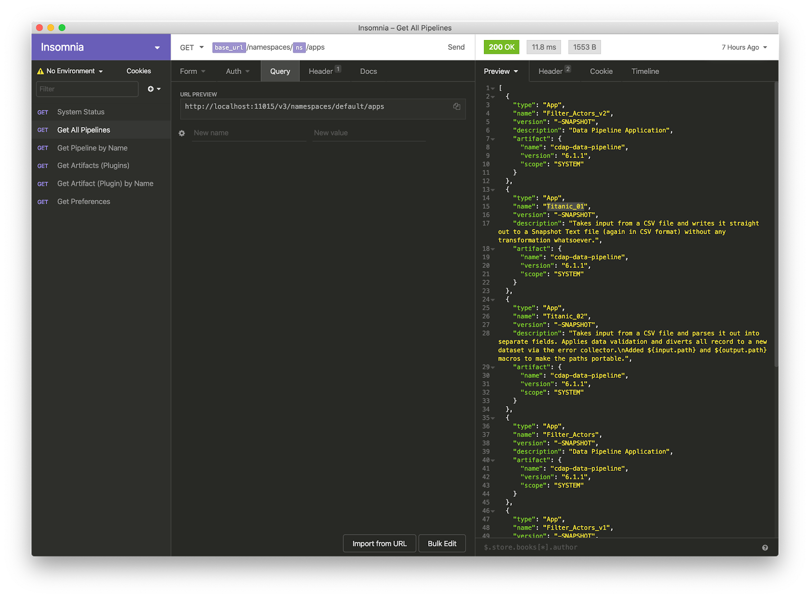
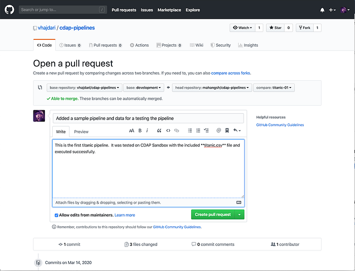
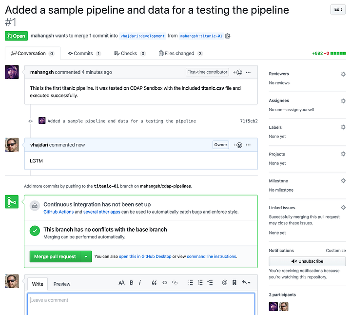
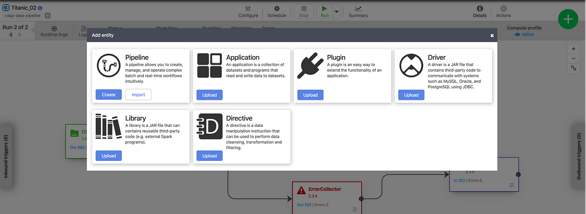

+++
author = "Veton Hajdari"
title = "CI/CD and Change Management for Pipelines — Part 2"
date = "2020-03-16"
tags = [
    "CDAP",
    "Git",
    "Gcp",
    "Data Analytics",
    "Cicd",
]

aliases = ["ci-cd-change-management-for-pipelines-2"]
image = "photo-1.png"
type = "blog"
+++

Welcome to the second article in this four part series. In the [first article](/blogs/ci-cd-and-change-management-for-pipelines--part-1/) I discussed some of the concepts related to continuous integration and testing. In this article we’ll get into some hands-on examples for extracting pipelines from CDF/CDAP and use GitHub as a repository for storing pipelines and related artifacts.

I will cover the following topics in this article:

*   Creating a checklist of all the artifacts you will need to test in a target environment
*   How to set up a GitHub project to house our pipeline artifacts
*   How to export pipelines from CDF/CDAP using the export tools in the UI and how to do it via the ReST API
*   How to check in our development pipelines to GitHub
*   How to deploy a pipeline to an alternate environment using both the UI and the ReST API

**Prepare a Checklist**
-----------------------

A pipeline exported in JSON format from CDF/CDAP defines a [Directed Acyclic Graph](https://en.wikipedia.org/wiki/Directed_acyclic_graph) (DAG) containing the sequence of operations that were designed visually, the plugins that are used by that DAG, and some configuration information for other components of the ecosystem where the pipeline will be executed.

So, if you already have the exported pipeline JSON, what else might you need?

The exported pipeline JSON itself is enough to recreate the visual representation of the pipeline on another instance of CDF/CDAP, but you will also need all the configuration information from the source system which is not contained in the pipeline itself. Therefore, it’s prudent to create a checklist of all the information you will need when promoting a pipeline from one environment to another.

Here’s all the information you need to take into consideration:

*   **Pipeline** — The exported JSON of the pipeline DAG.
*   **Plugins** — These are the actual JAR files containing the code of the plugins themselves. Your pipeline might have different versions of the plugins or it may have custom plugins and UDDs that may not exist on the target system. If you used custom plugins and UDDs then you will need to transfer those artifacts as well.
*   **Datasets** — There is a good chance that the dataset you used for testing locally on your CDAP Sandbox instance might not be the same as the one on the target system.
*   **Preferences** — You can set preferences globally at the system level or at the namespace level, and if your pipelines use any of these preferences then you will want to ensure that the target environment is configured the same.
*   **Macros** — In order to make your pipelines portable across environments it makes sense to set any field that will change dynamically, based on the environment that it will be executed on, as macros.

I’ll discuss how to invoke a pipeline test on a target environment with the requisite system preferences and macro setting in the last article in the series. For now, make sure you stash your pipelines, plugins, and datasets into the git repository. Preferences and macros are key-value pairs and can be represented nicely in JSON format. This is the format I will use in later articles for storing and porting that information.

**GitHub Repo**
---------------

If you are new to GitHub and unfamiliar with **_git_** commands I highly recommend you read up on the topic from the multitude of sources available on the internet. This will not be a tutorial on Git, but you should be able to follow along with the git workflow. The scenario I will use in this project is a two person team that works in tandem to both develop and review the work of the other party.

The github repo for these examples can be found here: [https://github.com/vhajdari/cdap-pipelines](https://github.com/vhajdari/cdap-pipelines)

You can start off by creating a new fork of the GitHub repo I set up for this project. Once you have forked the project you can clone it to your local machine.

> git clone [https://github.com/vhajdari/cdap-pipelines.git](https://github.com/vhajdari/cdap-pipelines.git)

This will create a local folder named **cdap-pipelines** containing the contents of the git repo.

I created another user in github and forked the [https://github.com/vhajdari/cdap-pipelines](https://github.com/vhajdari/cdap-pipelines) repo into the new account. Keep in mind that you will need to create your own repo in order to check in new files.

**Export Pipelines**
--------------------

I developed a rudimentary pipeline with three stages that looks like this:

To export this pipeline from the UI click on the **Actions** icon on the top right of the screen and select **Export**. This will bring up a new window that will let you inspect the pipeline JSON. Click **Export** to save the file. The pipeline JSON can now be added to your GitHub repo.

**Bulk Export Pipelines**

Exporting a one pipeline at a time can become very cumbersome if you have a large number of pipelines that you need to export. Unfortunately there is no way to bulk export all your pipelines from the UI. So, how can we get around this problem? This is where the ReST API comes to the rescue.

If you are familiar with **curl** or use tools like Postman or Insomnia, you can quickly get a handle on how the ReST API works. Go get a listing of all the pipelines in CDF/CDAP you invoke the following HTTP request using the GET option:

> [http://localhost:11015/v3/namespaces/default/apps](http://localhost:11015/v3/namespaces/default/apps)

This gives you a listing of all the deployed pipelines in the default namespace. In this example I used Insomnia. The curl version of this request is:

> curl — request GET \\
> 
> — url [http://localhost:11015/v3/namespaces/default/apps](http://localhost:11015/v3/namespaces/default/apps) \\
> 
> — header ‘content-type: application/x-www-form-urlencoded’

You will notice that this API request simply returns a listing of all the pipelines, but our goal was to export all the pipelines all at once! So, how can we accomplish that?

Well, once we have the list of the pipelines we can iterate over that list and extract the JSON of each pipeline. The API request to get the pipeline JSON for Titanic\_01 is as follows:

> curl — request GET \\
> 
> — url 'http://localhost:11015/v3/namespaces/**default**/apps/**Titanic\_01**'

To iterate over a list of pipelines and extract the one we want we would simply replace the last portion of the URL that has the pipeline name with the desired pipeline name.

This API returns the same JSON that we saw in the UI, and you can use the output option in **curl** to write out the content to a file. As you can ascertain from these API calls, we could easily script these HTTP requests to extract all the contents to the file system — and this is exactly what I have done with a simple Python script that extracts all pipelines from all namespaces and writes them out to disk. You can find the [export\_pipelines.py](https://github.com/vhajdari/cdap-pipelines/blob/master/util/export_pipelines.py) file in the **util** folder of the repo you cloned earlier.

Here’s the export script in action:

Once all your pipelines are exported you can copy the desired files to the pipelines folder in the git project. The python script I mentioned here is by no means comprehensive, and you may find that there are lots of other things that you may want to extract as well, but if you are so inclined it’s a good way to get started for learning how to script with the ReST API.

By the way, this is also how you can extract all the system preferences and some additional settings from the source environment so that you can add those settings to a file to support CI/CD efforts down the road. For example, we’ll want to extract all the system preferences — this is how to get them:

> curl — request GET \\
> 
> — url [http://localhost:11015/v3/namespaces/default/preferences](http://localhost:11015/v3/namespaces/default/preferences)

**Push to Git Repo**
--------------------

OK, now that you know how to extract pipelines both individually and in bulk, the next step is to check these pipelines into your git repository. Assuming you forked my GitHub repo to your own repo, you would clone your forked repo and work off of that. For this example I created a new branch for each pipeline I want to push to my repo.

Start off by configuring some global settings for your repo. This will help you avoid any pesky error messages when you attempt to push your code.

> git config — global user.email “you@example.com”
> 
> git config — global user.name “Your Name”

Create a branch for your work. In this example I used **titanic-01** as the development branch for the first pipeline I checked in to git.

> git checkout titanic-01

Once you’ve copied your pipeline JSON to the **_pipelines_** directory add all the files in the project folder to source control.

> git add .

You can check the state of the git repo at any time by running:

> git status

Now you are ready to commit your changes. Make sure to add a comment so that the commit is documented.

> git commit -m “This is a message that will explain what this commit contains”

Almost done. All that is left to be done is to push all the changes to the GitHub repository.

> git push origin titanic-01

Granted, all of the steps of exporting the pipelines and checking them into git can be scripted as well, but that would be left as an exercise for the reader since no two teams operate the same way, let alone different enterprises. You can get as elaborate as you want for this process, but to minimize bugs it’s always best to keep things simple.

**Pull Requests and Merges**
----------------------------

When working in your own feature branch, you have the freedom to make all the changes you want locally and check in whatever you would like to be merged with the upstream project. In order for the upstream project to reflect the changes we pushed to our git repository we need to create a pull request. You do this in the GitHub page.

Make sure to create the pull request against a branch that the maintainer is expecting to merge PRs in. In this case I’m creating a PR against the upstream development branch, and will leave it up to the maintainer to merge the development branch into testing, QA, or master (production) branch. These will come into play later when we configure CI/CD.

The maintainer will review, and can comment, accept, or reject the PR.

Deploy a Pipeline From Git
--------------------------

Deploying a pipeline from a cloned GitHub repo is a simple as performing an import in CDF/CDAP. Once again, the UI lets you do imports one pipeline at a time, but it also takes care a lot of the validation in the UI.

Pipeline validation includes things like:

*   Checking if the pipeline already exists
*   Checking plugin versions and upgrading to the latest versions as necessary
*   Upgrading to the latest version of plugins
*   Identifying missing plugins, and the ability to download from the hub.

To import from the UI locate the big green plus button. When you click it you will be presented with the following window:

Click the **Import** button on the Pipeline card and select the pipeline JSON from your file system. The pipeline with then load into edit mode in the studio where you can continue updating it or deploy it.

Alternatively, here’s an example of how to deploy a pipeline using the API with curl:

> _curl -X PUT “_[http://localhost:11015](http://localhost:11015/v3/namespaces/default/preferences)_/v3/namespaces/_**_namespace-id_**_/apps/_**_pipeline-name_**_” -d “@/path/to/the/pipeline/JSON”_

Make sure to substitute **namespace-id** and **pipeline-name** with your own values. In my case values are **default**, because I’m deploying it to the default namespace, and **Titanic-01,** which is the name I’ve given to this pipeline. The final component is the path to your pipeline JSON file. Don’t forget the **@** symbol before the path.

**_A word of caution._** Deploying a pipeline via API does not provide any validation like you have in the UI. Therefore, any validation that needs to take place needs to be encapsulated in your deployment code. Similarly to what I did with the pipeline export script in Python, you would have to perform each validation step if you want to ensure that the pipeline will have all the requisite artifacts on the target system.

Conclusion
----------

There you have it. Your pipelines are now in source control on GitHub. Of course, you don’t have to use GitHub for your VCS, but it is one of the most popular options in the open source community and has broad adoption among a majority of open source projects, including CDAP.

In this article we learned how to extract pipelines via the UI and ReST, and how the **export\_pipelines.py** script helps us export pipelines in bulk. I showed you how to check your pipelines into your repository with git, and how to create a PR to push your pipelines to the upstream repo for testing and promotion.

In the next article we’ll discuss the process for migrating artifacts from GitHub into a TEST, QA, or PROD environments. We’ll dig a little deeper into automation options and discover how we can leverage the API more broadly.

Until next time, stay safe and healthy, and wash your hands!