+++
author = "Veton Hajdari"
title = "CI/CD and Change Management for Pipelines — Part 3"
date = "2020-03-16"
tags = [
    "CDAP",
    "Google Cloud Platform",
    "Gcp",
    "Data Integration",
    "Ci Cd Pipeline",
]

aliases = ["ci-cd-change-management-for-pipelines-3"]
image = "photo-1.png"
type = "blog"
+++

Welcome to the third installment of this four part series. In the [first article](/blogs/ci-cd-and-change-management-for-pipelines--part-1/) I discussed some of the concepts related to continuous integration and testing. In the [second article](/blogs/ci-cd-and-change-management-for-pipelines--part-2/) we got into some hands-on examples for extracting pipelines from CDF/CDAP and used GitHub as a repository for storing pipelines and related artifacts.

In this article we’ll discuss the process of migrating artifacts from GitHub into a TEST, QA, or PROD environment, and explore automation options by leveraging the API more broadly.

Now that you have your pipelines checked into GitHub, deploying those pipelines onto another environment, like Cloud Data Fusion on GCP for example, is fairly straightforward. Once again, there are two ways we can accomplish this task. Either by using the UI in CDF/CDAP or by using the API. When dealing with one or two pipelines, using the UI is fairly easy and convenient, but when you have many pipelines to migrate this process can become cumbersome.

So, once again, it’s important to look at your checklist for what components a pipeline relies on, things like namespace preferences, custom plugins or UDDs, etc., and plan your migration accordingly.

GitHub Workflow
---------------

I’ve decided to use a migration strategy that relies on named branches in GitHub that correlate to my CDF/CDAP environments. Thus, I have branches named; development, test, qa, and so on. Any changes merged into the development branch can be merged into the test branch so that the pipelines in that branch can be tested on an environment that may resemble production.

Merge Development to Test
-------------------------

We start off by creating a pull request against the test branch so that our development work is merged to the test branch.

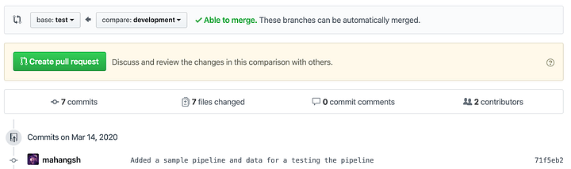

Next you create the pull request and provide a description for the PR.

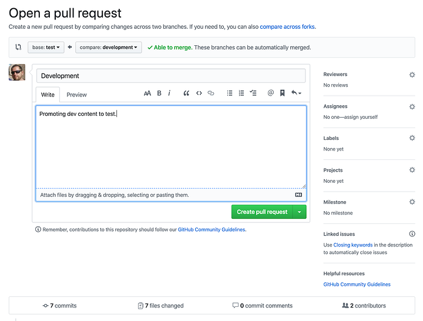

Once the PR has been created you can merge it to the test branch.

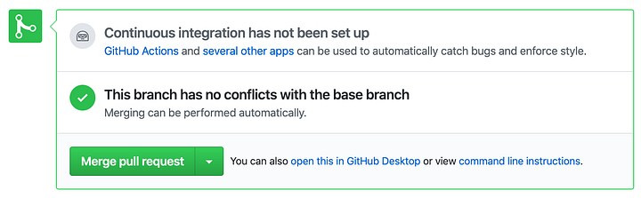

Finish by clicking on the confirm merge button.

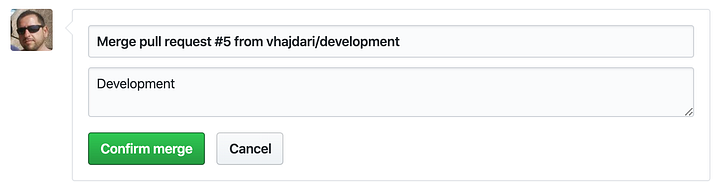

Once merged you will see a confirmation. The test branch now reflects all the changes in the dev branch.

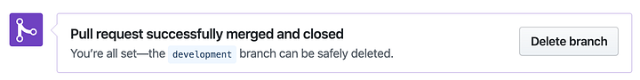

Clone Test Branch
-----------------

With the development branch merged into test, I’m now ready to clone the test branch and deploy my pipelines to the TEST environment. I’m specifying that I want to clone the test branch with the “-b test” parameter. Once the repo is cloned I can navigate into the pipelines folder and see the pipelines available for testing. My shell also provides a visual cue as to which branch I’m rooted in.

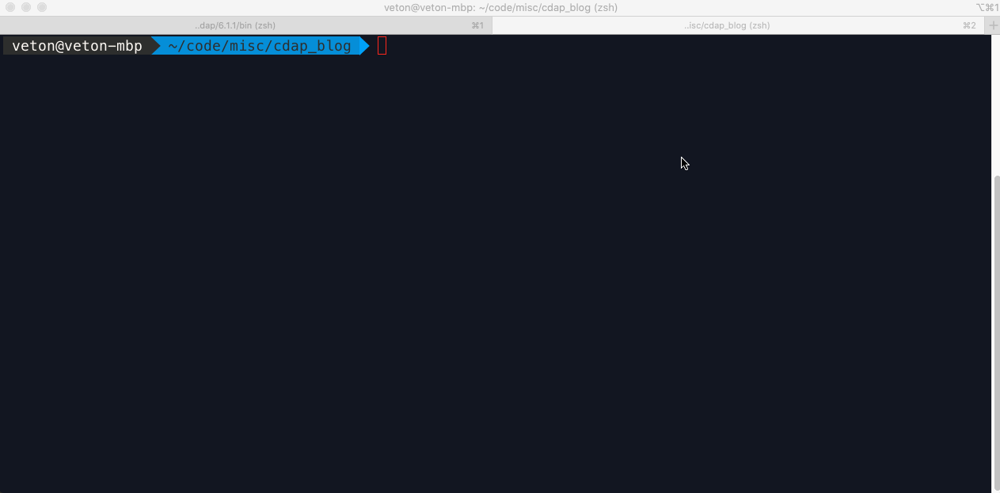

Deploy Pipeline
---------------

The procedure you use for deploying pipelines can vary when it comes to loading a number of pipelines in bulk, but the strategies to consider include using the CLI in combination with shell scripting, or using the REST API and writing a deployment utility in the language of your choice — similar to the extract-pipelines.py utility I wore for downloading all the pipelines from a CDAP instance, regardless of which namespace they belong to.

The CLI option is convenient because it’s included with your CDAP sandbox and you can automate the majority of functions you need for automating your deployments. But, if you really want maximum flexibility and the ability to programmatically control all aspects of the deployment, configuration, validation, and execution phases then you’ll want to use full fledged language like Python, Java, Go, or whatever programming language you fancy for working with REST APIs.

I have two pipelines that I need to deploy, based on what’s in the pipelines folder, and since I did not organize the pipelines into a namespace hierarchy I can deploy them as I like, into any namespace on the target system. But, what if I had few namespaces in my TEST or PROD environments, how would I know which namespace to deploy them to? Preferably the development environment should be configured to contain the same namespaces you intend to use in production so that the export script can create folders with the namespace name and place the associated pipelines for that namespace under the respective folder.

As and example, here’s how you can deploy a pipeline via REST:

> curl -X PUT “http://localhost:11015/v3/namespaces/**NAMESPACE\_NAME**/apps/**Titanic\_02**" -d “@./Titanic\_02-cdap-data-pipeline.json”

If we need to loop through all the pipelines that need to be deployed then we can write a script/program to replace the namespace name and the pipeline name in the URL as necessary.

To illustrate, in the example below I deploy the pipeline to a namespace called BAR.

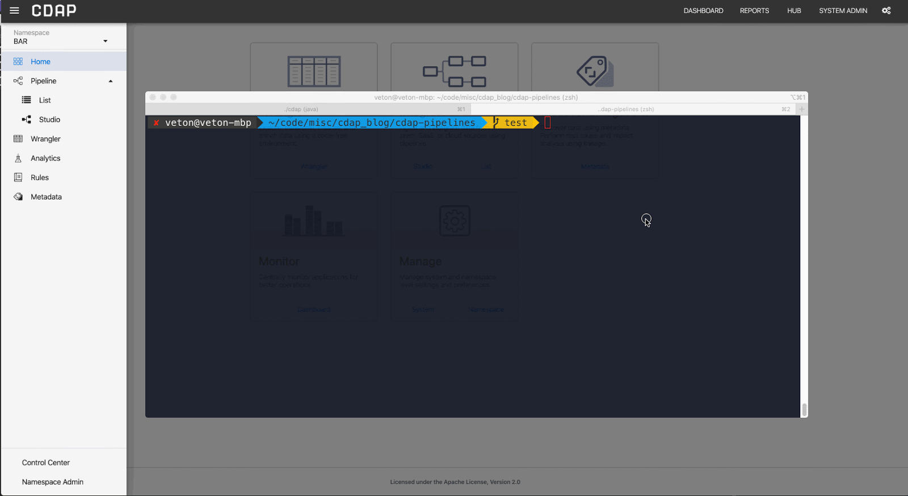

Deployment Gotchas
------------------

As I mentioned in the previous article, you’ll want to have a checklist of all the components that a pipeline relies on when you deploy it in another environment. Here’s what to look out for — especially if you will be writing your own automation utility.

Namespaces
----------

As mentioned earlier, you can use the CDAP sandbox CLI to access a remote CDAP instance. To connect to a remote instance via the CLI add the **_“ — uri \[IP\_ADDRESS|HOSTNAME\]”_** to the cdap cli command. If you have added the CDAP executable to your path then the command would look like this:

> cdap cli — uri [http://my\_cdap\_server.example.com:11015](http://my_cdap_server.example.com:11015/)

A CDF/CDAP instance can have any number of namespaces and it’s probably a good idea to validate that the namespaces match from one environment to another. Here’s how to get a list of namespaces using both the CLI and the REST API:

**CLI:**

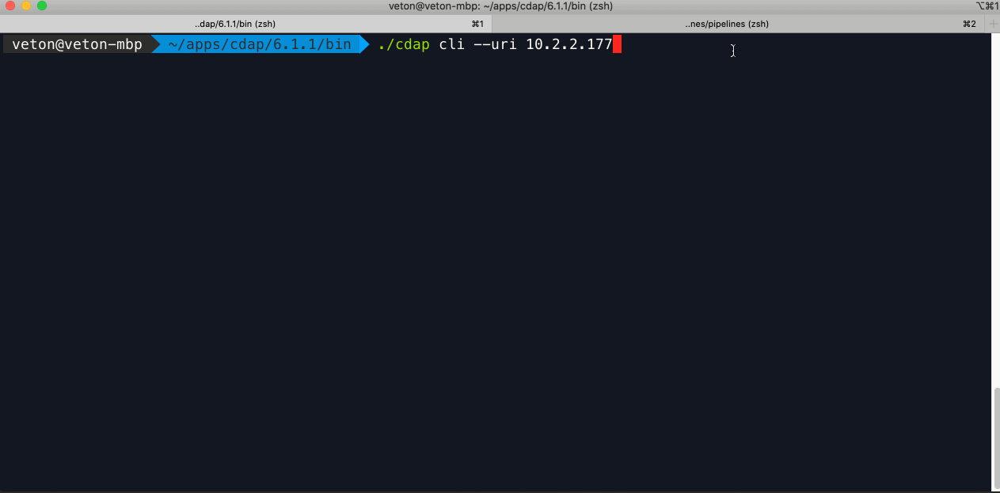

**REST:**

> curl — request GET \\
> 
> — url [http://localhost:11015/v3/namespaces](http://localhost:11015/v3/namespaces)

Now that you know how to retrieve the list of namespaces from a CDAP environment, it’s just as easy to create a namespace. Using curl the command looks like this:

> curl — request PUT \\
> 
> — url [http://localhost:11015/v3/namespaces/**NAMESPACE\_NAME**](http://localhost:11015/v3/namespaces/NAMESPACE_NAME)

Make sure to replace the namespace name with your own namespace. Once again, if you are scripting this then you can loop through namespace names, either from the folder hierarchy that was created by the export pipelines utility, or if you exported the namespace names into a separate config file — which is what I’d recommend.

**Preferences**
---------------

The next thing to watch out for is preferences that may have been set for each namespace and/or pipeline. There are a number of levels where preferences can be set, so make sure to take a look at the official documentation [here](https://docs.cdap.io/cdap/6.1.1/en/reference-manual/http-restful-api/preferences.html) for a better understanding. It’s important to at least capture any preferences related to a namespace as this is where global settings may have been set for macro key:value pairs associated to a namespace.

Here’s how to retrieve preferences for a namespace via REST:

> curl — request GET \\
> 
> — url [http://localhost:11015/v3/namespaces/**NAMSPACE\_NAME**/preferences](http://localhost:11015/v3/namespaces/NAMSPACE_NAME/preferences)

**Plugins**
-----------

Probably the biggest gotcha is the absence of a plugin in the target environment when you deploy a pipeline. Unlike the convenience of the UI, the REST API does not provide a single interface for handling all the plugin related issues you may encounter with your pipelines.

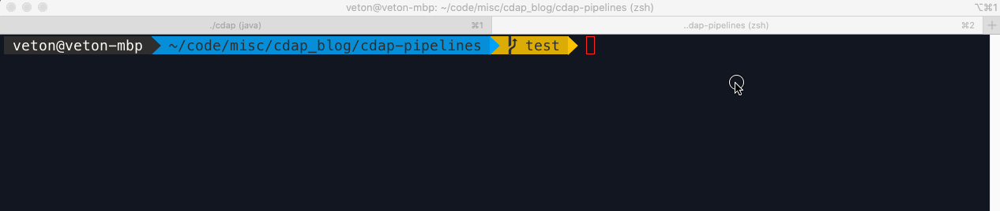

It is up to you to check whether a plugin exists on the target system and if it is at the correct version given your pipeline’s generation and the version of CDF/CDAP you are deploying to. Therefore, your plugin deployment utility has to perform all of the validation tasks in order for the pipeline to work properly on a target environment.

You need to start by checking the contents of the pipeline JSON for the version of CDAP and the list of plugins used in that pipeline, along with their respective versions. Next you need to check the target system to determine what plugins it has in any given namespace — again, different namespaces can have different user scope plugins. Based on this information you can make a comparison of the source and target environments and decide how to resolve the discrepancies with versioning and missing plugins.

Missing plugins would need to be uploaded, and if the plugin versions are newer or older than the source environment, then you need to either upload the matching versions as defined in your pipeline or modify the pipeline JSON so that the plugin versions match with the versions on the target environment.

Yikes…that’s quite a lot! Don’t fret though, the documentation is available [here](https://docs.cdap.io/cdap/6.1.1/en/reference-manual/http-restful-api/index.html).. When it comes to a production workflow, you’ll most likely want to keep your development environment identical to the rest of the environments (TEST & PROD) so that you don’t have to deal with all of the versioning issues. This way you can just focus on missing plugins, as would be the case if you are using custom built plugins or plugins from the hub. As before, you can use the CLI or REST API.

Let’s look at the CLI first. Make sure you are rooted at the correct namespace first — “**use namespace NAMESPACE\_NAME**”.

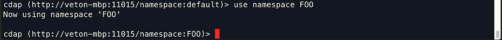

Once in the desired namespace load the plugin artifacts:

> load artifact /path/to/plugin.jar config-file artifact /path/to/plugin.json

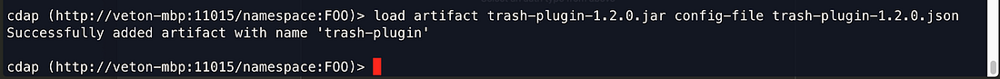

Example using REST API:

> curl -w”\\n” -X POST “http://localhost:11015/v3/namespaces/FOO/artifacts/trash-plugin" \\
> 
> \-H ‘Content-Type: application/octet-stream’ \\
> 
> \-H “Artifact-Extends: system:cdap-data-pipeline\[6.0.0-SNAPSHOT,7.0.0-SNAPSHOT)/system:cdap-data-streams\[6.0.0-SNAPSHOT,7.0.0-SNAPSHOT)/system:cdap-etl-batch\[6.0.0-SNAPSHOT,7.0.0-SNAPSHOT)/system:cdap-etl-realtime\[6.0.0-SNAPSHOT,7.0.0-SNAPSHOT)” \\
> 
> — data-binary @./trash-plugin-1.2.0.jar

Testing
-------

The whole point of cloning the test branch was to test our pipelines, so let’s get to it. As before, we would want to automate this process as much as possible as well. So what do we need to make sure we can run a test?

First thing you need to make sure is that the data source you used in your test will be available to you in your TEST environment. We provided the source data in the repo to automate the testing so all you need to do is copy the file to the target environment if the test data is not already there. In this case the cloned repo has everything we need, if you cloned the test branch onto the TEST server that is. In most scenarios this would not be the case, as the test environment may be remote to the system orchestrating the tests.

Most likely you will be using macros to define what source data you will be working with, so it makes sense to make these values dynamic and configure them with namespace preferences — see, this is why preferences are important!

Finally, if you have multiple pipelines to test it would be far more practical to create a script to loop through all the pipelines to test rather than executing them one by one.

> curl -X POST “http://localhost:11015/v3/namespaces/default/apps/Titanic\_02/workflows/DataPipelineWorkflow/start" \\
> 
> \-d ‘{ “input.path”:”/Users/veton/code/misc/cdap\_blog/cdap-pipelines”, “output.path”:”/Users/veton/code/misc/cdap\_blog/cdap-pipelines” }’

In the Titanic-02 pipeline I used macros, so I can pass those parameters in as a JSON object to the API call. Once again, if we were to write a program or a script to loop through all the pipeline tests we would extract the macro and preference values from a file and pass them in at runtime.

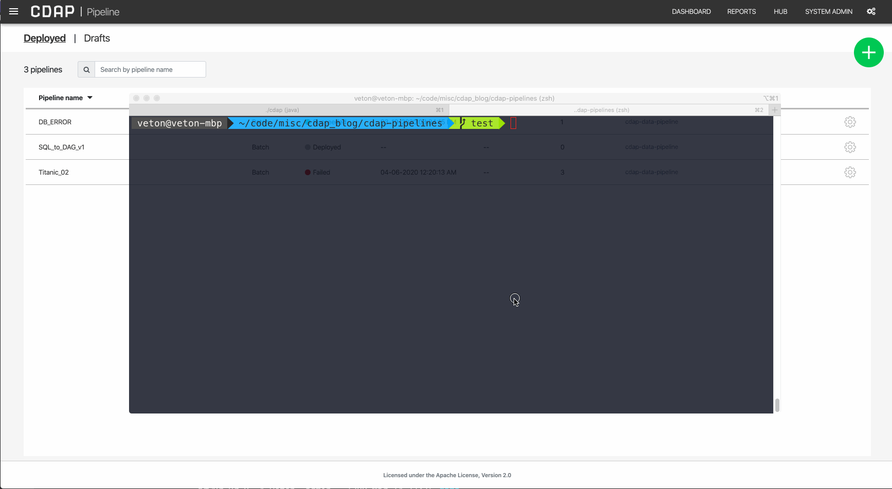

As you can see, when we invoke the pipeline execution via the REST API the UI swings into action and gives visual feedback of the activity taking place. And of course, we can see the results of our test in the output destination specified by the macro variable.

Conclusion
----------

In this article we learned how to use GitHub to promote pipeline artifacts from one branch to another to perform testing. You can repeat this process to promote your pipeline artifacts all the way through to production. Besides the git workflow for source control we discussed techniques for automating your deployment process using the CLI and REST API.

You can get as complex as you need to in order to have a fully automated system for deployment and testing, and I leave it up to you to come up with some creative ideas on how to accomplish this goal. There is a lot that can be done by leveraging the API with programming languages like Python, Java, Go, and many others, and for general automation shell scripting works great. Experiment with some of these and see how much mileage you can get out of a simpler approach first.

As we look to wrap up this series, we’ll dive a little deeper into automation and take a look at Jenkins as a way to automate some of the tasks we’ve done manually so far. Stay tuned for the next article.

Until next time, stay safe and healthy, and mind your social distancing!