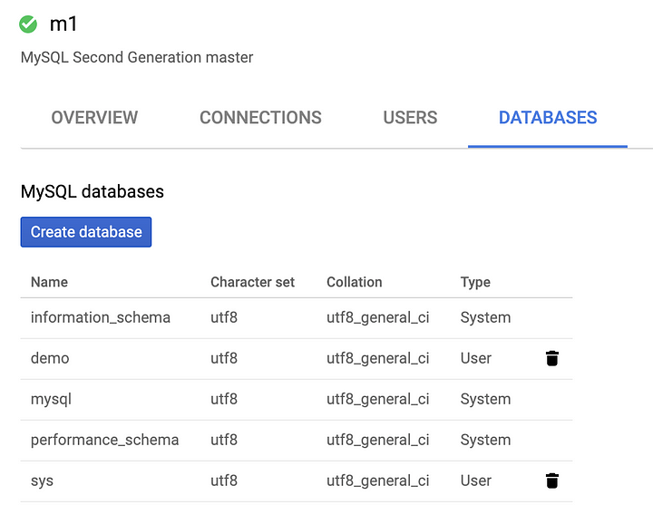

+++
author = "Veton Hajdari"
title = "Cloud Databases & CDAP - Part 1"
date = "2019-09-09"
tags = [
    "Google Cloud Platform",
    "Integration",
    "Open Source",
    "Google Cloud Sql",
    "Cdap",
]
aliases = ["cloud-databases-cdap-1"]
image = "photo-1.png"
type = "blog"
+++

How to integrate CDAP with Google CloudSQL
------------------------------------------

This is part one of a **_three part series_** that will walk you through the following concepts:

1.  Configure Google CloudSQL with two databases; MySQL and Postgres.
2.  Build the custom JDBC drivers to connect to the CloudSQL databases with CDAP.
3.  Load databases with sample data, and create a pipeline that joins data from two separate databases in a single pipeline.

The concepts covered in this series will allow you to either configure CDAP locally or use Cloud Data Fusion, Google’s cloud managed version of CDAP. The databases created in the cloud will be accessible by CDAP locally or in the cloud, and the pipelines that will use the database sources will be able to run in the cloud without any modification.

Databases in the Cloud
----------------------

Google’s Cloud SQL is a fully managed database service that makes it easy to set up, maintain, manage, and administer your relational PostgreSQL and MySQL databases in the cloud.

Building data integration pipelines with CDAP and Cloud SQL is no different than accessing any other relational database over JDBC, with the exception of how security is handled in GCP.

1\. Enable the API
------------------

The first step is to make sure that the SQL Admin API has been enabled. If you miss this step you may encounter errors later on when trying to connect to the desired database instance.

Go to APIs and Services and enable [Cloud SQL Admin API](https://pantheon.corp.google.com/apis/library/sqladmin.googleapis.com).

2\. Create the Database Instances
---------------------------------

Once the API has been enabled navigate the the [SQL console](https://pantheon.corp.google.com/sql) and create an instance. Assuming this is the first time you are creating a Cloud SQL instance you’ll be presented with the illustrations listed bellow. If you have already created your databases you can skip this section.

These steps need to be repeated for both PostgreSQL and MySQL, so that you end up with two separate database instances.

Select a database engine and create your first instance.

For my fist instance I’ve selected the **MySQL** database engine. The instance id in this case is “**m1**” and the password can either be generated for you by clicking on the **_Generate_** button, or you can provide your own. Make sure to choose a strong password. Place the instance in a region and zone that meet your needs.

Now that the first instance creation has been initiated you can click on the **_create instance_** link to start creating the next instance, this time **PostgreSQL**.

Repeat the process for the second db instance.

When done you will see both your instances listed in the SQL console.

Next we’ll move on to creating the sample database and user.

3\. Create a Sample Database and Users Account
----------------------------------------------

In the subsequent steps we’ll walk though creating a sample database for each database engine and a user that we can use to access the database.

Select your fist database instance and click the **_Create database_** button. In this case I’ve started with PostgreSQL. Name your database something meaningful and click **_create_**. I’ve chosen to name my database “**demo**.”

After a few minutes your new database will appear in the list of databases.

Now, to create the user account. Go to the Users link and click on the **_Create user account_** button. For the purposes of this example I’ve chosen “**dba**” as both the user name and password. In a real-world scenario make sure to chose an account that satisfies your needs and use a secure password.

We can now see that the user account has been created on the database and it’s ready for testing.

Repeat the process for the MySQL database instance as well. The UI elements are slightly different for MySQL and have been included here for illustrative purposes. I used the same exact database name and user name for each instance in order to simplify the examples that will be used for configuring the connections later.

Now that the configuration for both PostgreSQL and MySQL is complete we can move on to setting up the connectivity from CDAP. Make sure to follow Google’s recommendation for testing connectivity [here](https://cloud.google.com/sql/docs/mysql/quickstart-proxy-test).

In the next blog I’ll show you how to build the custom JDBC drivers that are required for CloudSQL and how to configure CDAP to use the drivers.