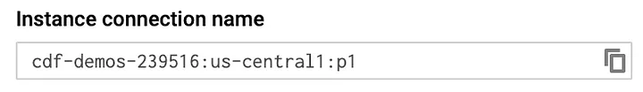
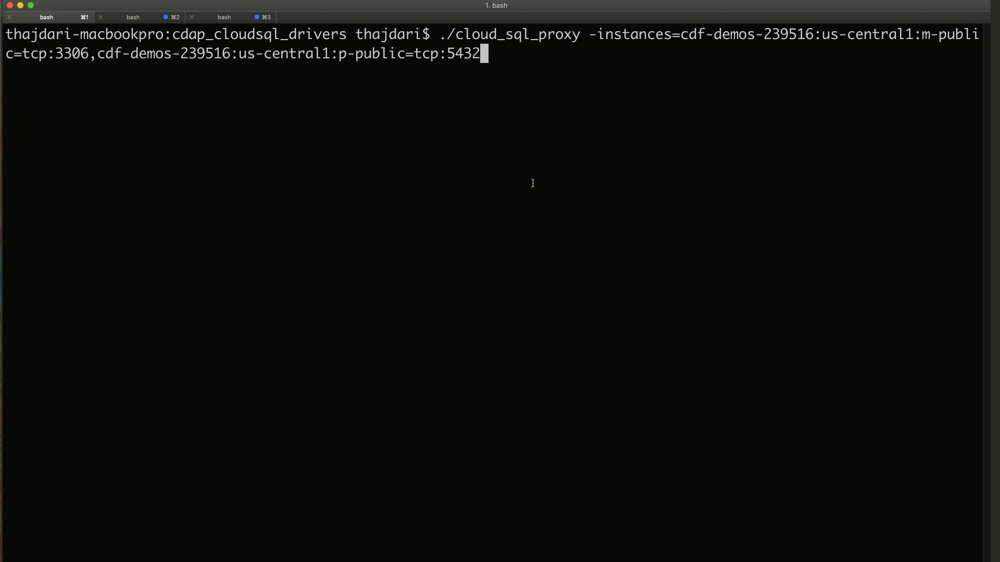

+++
author = "Veton Hajdari"
title = "Cloud Databases & CDAP - Part 2"
date = "2019-09-09"
tags = [
    "Google Cloud Platform",
    "JDBC",
    "Cloud Data Fusion",
    "Google Cloud Sql",
    "Cdap",
]
aliases = ["cloud-databases-cdap-2"]
image = "photo-1.png"
type = "blog"
+++
Welcome to **part two** of this three part series. In [part one](/blogs/cloud-databases--cdap---part-1/) I discussed how you can create the cloud database instances on Google Cloud SQL. In this second part I’d explain how to build the custom JDBC drivers that are required for connecting to the MySQL and Postgres databases from CDAP and Cloud Data Fusion.

Finally, in the last part I’ll discuss how to load the databases with sample data, and create a pipeline that joins data from two separate databases in a single pipeline.

Build the JDBC Drivers
----------------------

Cloud SQL requires the use of the [Socket Factory library for JDBC drivers](https://github.com/GoogleCloudPlatform/cloud-sql-jdbc-socket-factory) which don’t come included with the JDBC drivers supplied by MySQL or Postgres. So, in order to include that dependency in our JDBC drivers we’ll need to build them ourselves.

1\. Set up Maven
----------------

We’ll use [Maven](https://maven.apache.org/download.cgi) to build the JDBC drivers. Download [Maven](https://maven.apache.org/download.cgi), unzip the archive to a desired location on your machine, and update your environment’s PATH variable so that it points to the **mvn** binary:

> **export PATH=$PATH:/home/username/maven/bin/**

2\. Clone the Git Repo
----------------------

In the terminal type:

> **git clone** [**https://github.com/vhajdari/cloud-sql-jdbc-socket-factory.git**](https://github.com/vhajdari/cloud-sql-jdbc-socket-factory.git)

This will create a directory named **cloud-sql-jdbc-socket-factory**.

2\. Build the JDBC Drivers
--------------------------

Change into the cloud-sql-jdbc-socket-factory directory created in the previous step and run the following mvn command to build all the drivers in one go:

> **mvn -P jar-with-dependencies clean package -DskipTests**

When the build completes you will find a new **_target_** sub folder created within each of the module directories. Within these target directories locate the files named:

> mysql-socket-factory-connector-j-8–1.0.15-jar-with-dependencies.jar
> 
> postgres-socket-factory-1.0.15-jar-with-dependencies.jar

These files will be needed in the following steps.

Configure JDBC Connectivity
---------------------------

Now that we have our custom JDBC drivers built we can now focus our attention to configuring the connectivity to the Cloud SQL databases with both Data Fusion and CDAP.

1\. Set up Data Fusion
----------------------

Launch your Data Fusion instance and navigate to Wrangler. In wrangler click on the **_Add Connection_** button at the bottom left of the screen and then upload the JDBC drivers, the ones from the previous step, in sequence to the the respective Cloud SQL driver configuration sections.

Once the driver has been uploaded for MySQL and Postgres, you can now configure the driver to connect to their respective databases.

The connection name can be anything you want, but make it descriptive enough so that if you have multiple connections in the Database dropdown it will be easier to quickly identify which one is which. The user name and password will be the same ones you provided when you created the database instances. Now, the JDBC connection string is a bit tricky, so make sure to replace the components of the string that match your environment, namely, you’ll want to copy the setting from the Cloud Console so that you have the exact strings.

Enter connection string as:

> **For MySQL**:  
> jdbc:mysql://google/**<DATABASE>**?cloudSqlInstance=**<INSTANCE\_CONNECTION\_NAME>**&socketFactory=com.google.cloud.sql.mysql.SocketFactory&useSSL=false
> 
> **For Postgres**:  
> jdbc:postgresql://google/**<DATABASE>**?cloudSqlInstance=**<INSTANCE\_CONNECTION\_NAME>**&socketFactory=com.google.cloud.sql.postgres.SocketFactory&useSSL=false

where **<DATABASE>** represents the database you created in a previous section, and **<INSTANCE\_CONNECTION\_NAME>** refers to you instance connection name as displayed in the overview tab of of the instance details page, e.g:

**_Example_**:

> jdbc:postgresql://google/**demo**?cloudSqlInstance=**cdf-demos-239516:us-central1:p1**&socketFactory=com.google.cloud.sql.postgres.SocketFactory&useSSL=false

Click **Test Connection** to verify that the connection can successfully be established with the database.

If all went well then you’ll see a successful connection established with a database indicating that your configuration is correct.

Click **Add Connection** to complete the task.

Once you’ve completed all the steps you will be able to click on the newly defined database connection and see the list of tables for that database.

2\. Set up Cloud SQL Proxy
--------------------------

We need to repeat the same steps for CDAP so we can access the cloud databases from our local sandbox instance, but one notable difference is that we can’t connect to our Cloud SQL instances of MySQL and Postgres directly using their respective public IP addresses. In order to connect to these database instances we would have to configure a few network related settings to gain access over the internet, but this is cumbersome and prone to security concerns that we’d rather avoid. Of course, there is another way we can access these databases from across the internet.

Google provides a proxy that you can use to connect to Cloud SQL, so we’ll configure that next. You can learn more about the Cloud SQL Proxy and how to configure it for your specific environment [here](https://cloud.google.com/sql/docs/mysql/quickstart-proxy-test).

Install the proxy client on your local machine
----------------------------------------------

Make sure to download the version that is intended for your OS — in my case it’s MacOS.

Download the proxy with **curl**:

> curl -o cloud\_sql\_proxy [https://dl.google.com/cloudsql/cloud\_sql\_proxy.darwin.amd64](https://dl.google.com/cloudsql/cloud_sql_proxy.darwin.amd64)

Make the binary executable:

> chmod +x cloud\_sql\_proxy

Start the proxy so that you can connect to both MySQL and Postgres from your local machine. Replace the **<INSTANCE\_CONNECTION\_NAME>**with the one matching your configuration as you did in the previous steps.

> ./cloud\_sql\_proxy -instances=**<INSTANCE\_CONNECTION\_NAME>**\=tcp:3306,**<INSTANCE\_CONNECTION\_NAME>**\=tcp:5432 &&

**_Example_**:

> ./cloud\_sql\_proxy -instances=cdf-demos-239516:us-central1:m1=tcp:3306,cdf-demos-239516:us-central1:p1=tcp:5432 &&

Since the proxy is running on our machine all connections will be directed to **localhost**, so when we configure our JDBC drivers locally we’ll point them to **_localhost_** for the host setting.

To test your JDBC connectivity through the proxy use your preferred JDBC client. In my case I’m using [**DBeaver**](https://dbeaver.io/download/). The following screen-cast illustrates this.

3\. Set up CDAP
---------------

Now we can configure CDAP to connect to the Cloud SQL databases.

The steps are identical to the ones provided for Data Fusion. You will load the same exact drivers, with the only difference being that the connection string for CDAP will be pointing to **localhost**, and you must have the proxy running in order to access the cloud database instances.

For CDAP enter the connection string as:

> **For MySQL**:  
> jdbc:mysql://localhost/**<DATABASE>**
> 
> **For Postgres**:  
> jdbc:postgresql://localhost/**<DATABASE>**

CDAP Configuration Screencap

In summary, for this portion of the blog we built the custom JDBC drivers to connect to the CloudSQL databases with Data Fusion and CDAP. We tested JDBC connectivity both though CDAP and through a third party SQL client, DBbeaver, and we now know that we can continue working with our databases both in the cloud and locally. In the next blog article I’ll walk you through loading the databases with sample data, and create a pipeline that joins data from two separate databases in a single pipeline.

See you next time.