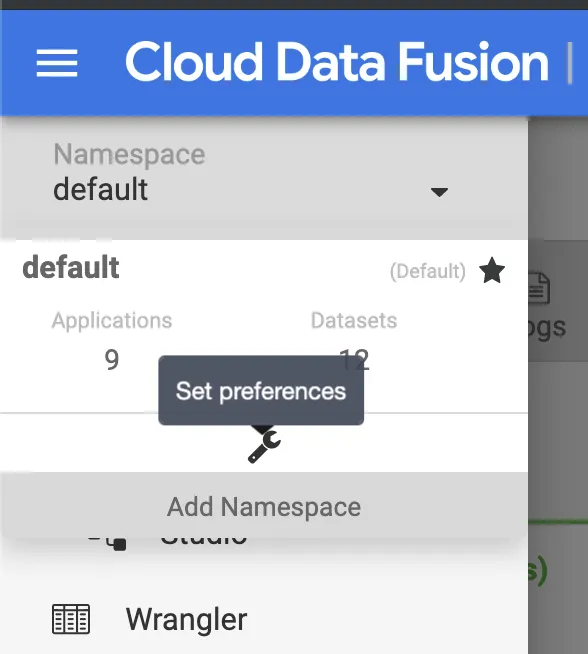
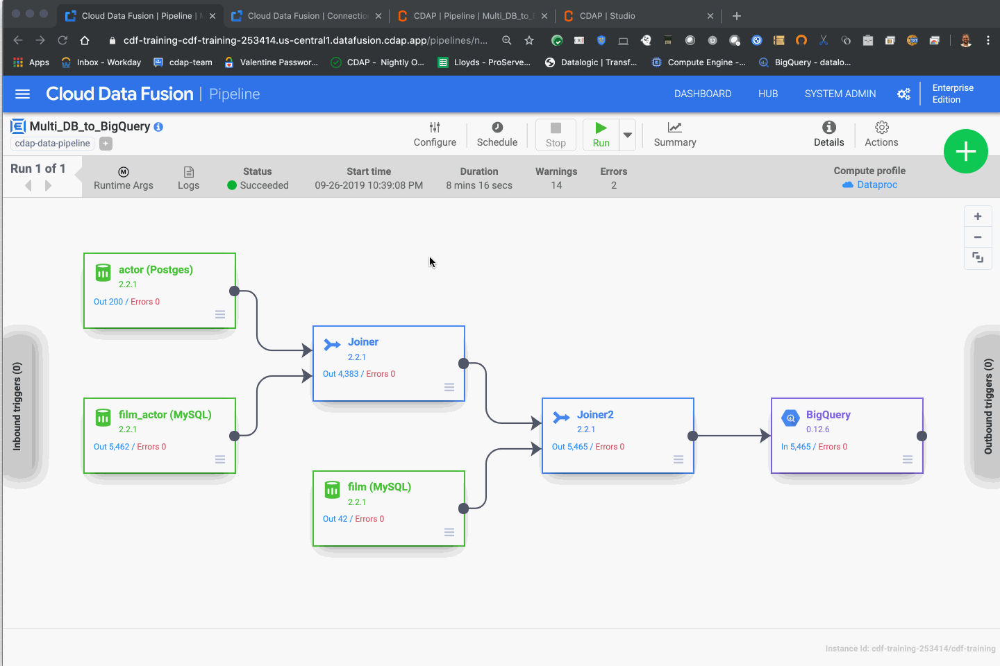

+++
author = "Veton Hajdari"
title = "Cloud Databases & CDAP - Part 3"
date = "2019-09-30"
tags = [
    "Google Cloud Sql",
    "Data Integration",
    "MySQL",
    "Google Cloud Sql",
    "Cdap",
    "Postgres",
]
aliases = ["cloud-databases-cdap-3"]
image = "photo-1.png"
type = "blog"
+++

In [part 2](/blogs/cloud-databases--cdap---part-2/) of this series we set up and tested connectivity to the Cloud SQL databases for MySQL and Postgres. In this final article I’ll walk you through he process of loading data to Cloud SQL and using both MySQL and Postgres database instances to build a pipeline where we can join data from disparate databases and write the resulting data to yet another database, BigQuery to be exact.

The fist step requires that we load some data to our database. There are a number or sample databases available on the internet when working with MySQL or Postgres, and the one I’ll use here is a popular sample database called Sakila. Originally created to showcase MySQL, Sakila has also been ported over to Postgres as well and is named Pagila, keeping with the naming of the original.

Start by downloading and extracting the database archives to your machine. You can find the Sakila database [here](https://dev.mysql.com/doc/index-other.html), and Pagila [here](https://www.postgresql.org/ftp/projects/pgFoundry/dbsamples/pagila/pagila/).

Load Data to DB
---------------

Loading the data to the respective database instances can be done a number of ways, but bear in mind that you might have to do some minor tweaks to the bundled sql schema files to get them to conform to Cloud SQL particularities. For the most part make sure that you change the database to **demo** and use the same user and password you configured in the cloud console.

You can load the data directly from cloud console, and for the actual insert statements for the data loading this is what is preferable when the data volume is large, but in my case I’m gonna stick to my local SQL client so that I can observe all operations and make adjustments accordingly. As I did in the previous blog, I’ll use DBeaver for this purpose and connect through the local **cloud-sql-proxy**.

The goal here is not so much to focus particularly on data loading techniques, as there are a great many tutorials just a Google search away, but if you are able to at the very least invoke the **_create table_** statements and load a few tables that have data you can join then you should be good to go.

In the following screencast I demonstrate the data loading process I went though and some minor tweaks I made along the way, like renaming the DB to demo, commenting out the trigger parts, and fixing the storage engine to InnoDB. I applied the same techniques to the Posgres DB as well.

Create Pipeline
---------------

With the database tables loaded I can now proceed with the pipeline building process. The first part is connecting to the database instance in the cloud with my local CDAP sandbox instance and validating that I can indeed see the DB data. Once I’m able to browse the table data I create a pipeline from each Wrangle. I repeated this process twice so that I could copy and paste the plugin with all the configuration details filled in to the primary canvas.

I repeat the copy paste process once more to get all three tables I want for the join, and test the pipeline locally with a Trash sink. If you have never used the Trash sink, it’s comes in very handy when you want to just focus on pipeline logic and not have to worry about configuring all the sinks settings just to test things out. After everything is working as expected I export the pipeline JSON locally on my machine.

The DB source plugins include a SQL query section where you can specify the query to run for the table and retrieve the schema for that record set. This however is not limited to just `select *` on the table name. It can be a view or a complex query as well. The resulting record set will have a schema that will be derived from that query and it can be used to for further processing down the pipeline.



Deploy to Data Fusion
---------------------

Once the pipeline has beed tested successfully on your local instance of CDAP it can then be imported into the Data Fusion instance on GCP. Because the connections strings were converted to macros the pipeline is now portable.

The database configuration can be further templatized to exclude all remnants of the configuration such as user name and password, in order to make the pipeline truly portable from environment to environment. I’ll cover this technique in a later blog where I explain how you can leverage a KMS to store sensitive information like passwords and other sensitive information.

In this case I wanted to demonstrate how you can use the technique to add the configuration setting to a **namespace** and set preferences at that level. To add key/value pairs as configuration parameters, simply access the preferences link for the desired namespace and add your settings there as illustrated in the screencast. You can also get there by clicking on the hamburger icon, select the namespace dropdown, and click on the wrench icon for the namespace:

Run the Pipeline
----------------

With all the settings in place, you can now run your pipeline on Dataproc by invoking it from Data Fusion. All the database connection parameters will be picked up by Data Fusion and passed to the Dataproc cluster for processing.

Macro resolution will kick in for the BigQuery fields that need to be filled out at runtime, and the database connections strings will be pulled directly from the namespace preferences set up earlier.

Conclusion
----------

Thank you for your time and patience — especially if you followed along through the entire three part series. Hopefully you now have the knowledge and the confidence of how to tackle multi database pipelines both locally and in the cloud. The techniques described here are broadly applicable to other types of databases and you can take this even further by joining file data in the same pipeline as well.

Along the way you learned how to set up CloudSQL and use the proxy to communicate easily with the cloud database instances with the tools you normally use in your daily duties. You now know how to build the custom JDBC drivers for CloudSQL, and you learned how to templatize the pipeline so that you can build it locally and run it both on your machine and in the cloud.

Stay tuned for more blogs as we dive in deeper to a myriad of features that CDAP has to offer.