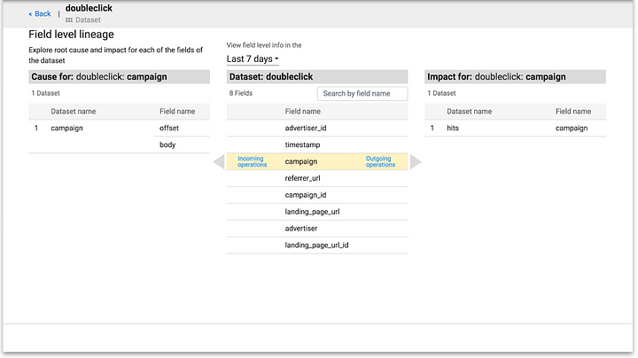
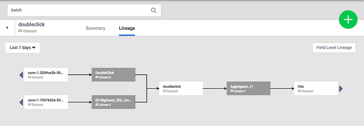
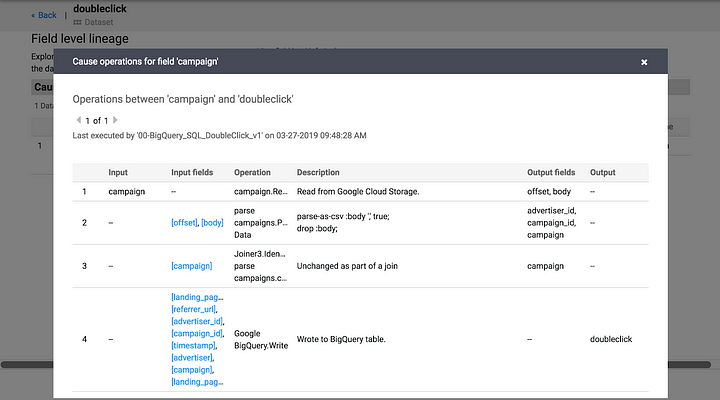
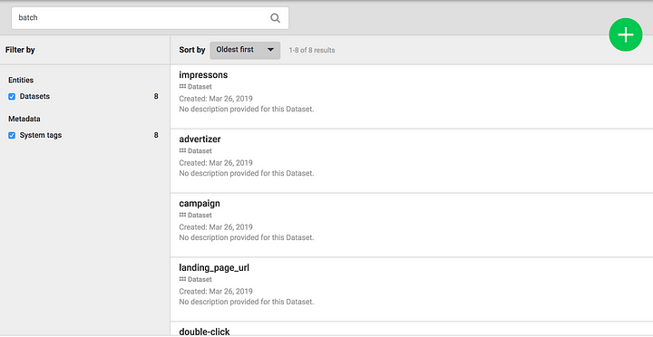
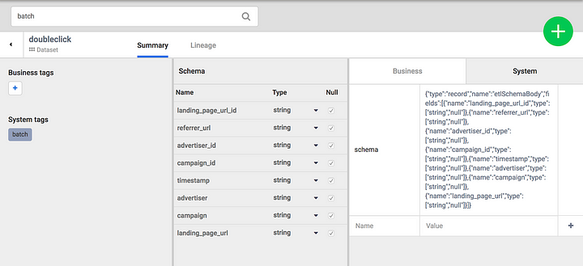

+++
author = "Veton Hajdari"
title = "Data Integration with Field Level Lineage"
date = "2019-06-11"
tags = [
    "CDAP",
    "Cloud Data Fusion",
    "Data Lineage",
    "Data Integration",
    "Field Level Lineage",
    "FLL",
]

aliases = ["data-integration-field-level-lineage"]
image = "cdap-logo.png"
type = "blog"

+++

Arguably, data is the most important asset that an organization owns, and in today’s climate of data security and stewardship it’s more important than ever to understand how that data was produced and the journey it has undertaken leading to its present state. Regulated industries like healthcare and finance have strict measures in place to ensure data privacy end security, and more recently with the introduction of GDPR data governance and lineage are more important than ever before. Given the explosive growth of data, maintaining a catalog of all that data can be extremely expensive and very cumbersome without a unified solution that addresses both the processing and storage aspects of that data.

Fundamentally metadata management serves to answer the all important question of where did the data come from and how did it get here? Ever since version 3.2 [CDAP](http://cdap.io/) has provided the capability to capture rich metadata and provide users a self-service experience for visualizing how data is flowing into, within, and out of a Data Lake. With the introduction of CDAP 6.0 Data Governance and Lineage becomes even more powerful and fine grained with Field Level Lineage (FLL). The latest version of CDAP introduces a new capability for metadata management that allows for far more insights into how data is transformed from its original state to its final state by exposing its providence and processing logic responsible for transformations of data down to the field level.

These capabilities are available to you regardless if you use the CDAP open source or Cloud Data Fusion, Google’s managed service offering of CDAP.

**Why is Data Lineage important?**

*   Reduces risk by identifying gaps in business processes.
*   Provides confidence in knowing the providence of the data and if we believe it to be an authoritative source.
*   Sets expectations as to the validity and correctness of the data.
*   Illuminates the business rules responsible for the data transformations.
*   Enables auditing for data governance.
*   To understand the impact of changing a dataset and how it affects other datasets, processes or queries.

CDAP metadata helps show how datasets and programs are related to each other and helps in understanding the impact of a change before the change is made. These features provide full visibility into the impact of changes while providing an audit trail of access to datasets by programs and applications. Together, they give a clear view when identifying trusted data sources and enable the ability to track the trail of sensitive data.

When working with data transformation tools and methods EL, ETL or ELT (short for Extract Load, Extract Transform & Load and Extract Load & Transform), typically comes to mind. ETL or ELT in the traditional sense can be considered as an activity tied to relational database systems, primarily for moving data in and out of databases, but with the advent of data lakes the scope has changed. Now EL, ETL and ELT are common activities across database systems as wall as non-relational data processing platforms like Hadoop and No-SQL systems.

**What are some of the challenges that CDAP overcomes with FLL?**

Often times it is difficult to discern where a particular field in a dataset originated from, and how it was transformed along the way resulting in its final state. In Big Data systems the source of data can be very messy. There are numerous file formats to contend with and data often lands into data lakes in a non structured format. The source data could have come from a structured source, like a database, a semi-structured source like CSV, XML, or JSON, or from a completely unstructured source like a blog post.

With FLL you now have a way of tying back an operation on individual fields in a dataset all the way back to the source. As part of a CDAP data pipeline job, when data is consumed from external systems or from within the data lake, the metadata collection process starts and is propagated through each stage of CDAP pipeline or workflow. CDAP’s plugins architecture allows end users to extend the capabilities of the plugins that consume and produce data to track as much metadata as is desirable. Access to this metadata allows for answering important questions like what data is being accessed, what programs are using the data, what is popular on your cluster. This not only unlocks the true value of the data, but also provides confidence as to how business have been applied across pipelines.

Metadata management in CDAP provides a broad set of features, including:

**Search**

The ability to search for any attribute associated with a program or a dataset. This can include any portion of a string that makes up the name of a dataset, a field in that dataset, a user provided tag, business metadata provided by the user as key/value pairs or system generated metadata — such as the input format used by a map reduce function.

**Date Filter**

Filter out all other activities associated with a dataset or program so that you can focus on metadata associated with the time range you are interested in.

**Summary**

Metadata associated with a selected search result provides a summary of useful information that help you easily understand the data related to your inquiry. The information available in the summary view includes:

*   Machine generated system metadata
*   User supplied business metadata
*   Schema
*   Business Tags
*   System Tags

**Lineage**

A Directed Acyclic Graph (DAG) that allows you to visualize how data flows from source to sink. Shows the relationship between an entity and the programs that are interacting with it.

**Graph Traversal**

Elements of the DAG are selectable so that you can refocus your inquiry on a particular element of the pipeline.

**Data Preview**

An integrated preview of a subset of records that can be viewed without the need to write an SQL query.

**Audit Log**

Shows each record in the audit logging dataset that has been created for that particular entity, displayed in reverse chronological order.

**Conclusion**

Data Governance and Lineage are important requirements for any organization operating a data lake or warehouse, regardless of whether it is deployed in a public cloud or on-premises. In working with our banking and finance customers we saw first hand the challenges they faced with being able to confidently identify how data was transformed from its original state and the ability to track those changes down to the field level and the need for a unified toolset that not only provided the necessary data lineage and auditing capabilities down to the field level, but also enriching the metadata by injecting business tags for those fields.

CDAP makes it easy to discover datasets and data fields, perform impact analysis, trace the lineage of a dataset, and create audit trails by automatically capturing and indexing technical, business and operational metadata for any pipelines built with CDAP. If you are already using CDAP the experience of using the FLL features will feel very natural. Download and try CDAP from here. You can use CDAP either in sandbox mode, running on your very own laptop, or try out CDAP on Cloud Dataproc or EMR with the available connectors for GCP.