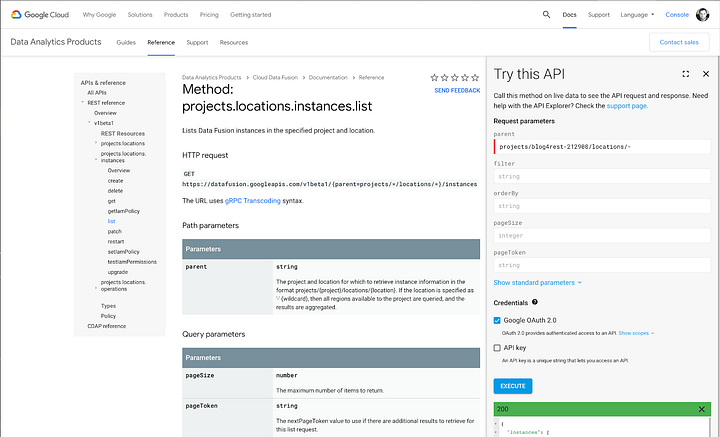
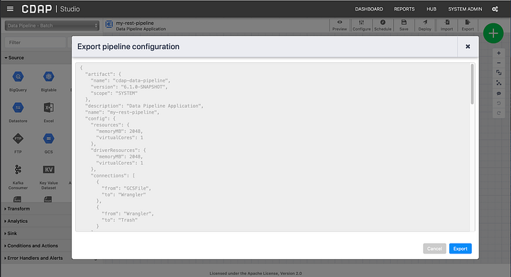

+++
author = "Veton Hajdari"
title = "Deploying and Running CDF pipelines with REST"
date = "2020-01-13"
tags = [
    "Google Cloud Platform",
    "Cdap",
    "Data Pipeline",
    "Rest Api",
    "DevOps",
]
aliases = ["deploy-run-cdf-pipeline-with-rest"]
image = "photo-1.png"
type = "blog"
+++

By now you probably know that you run CDAP pipelines on Cloud Data Fusion (CDF), but did you know that you can also control your CDF instance remotely using the rest API. In this blog I will walk you through the process of deploying and starting a CDAP pipeline on CDF using only a REST client. We’ll use the handy **curl** utility since it is easy to work with and is available on most platforms.

Using the REST API you can do quite a lot with CDF. You can create an instance from scratch, retrieve information about running instances, deploy pipelines and run them, and all the sorts of things that DevOps folks get the warm and fuzzies over. The underlying CDAP API is well documented on the [CDAP site,](https://docs.cdap.io/cdap/current/en/reference-manual/http-restful-api/index.html) so it’s probably a good idea to head over there for a quick glance at the types of things you can use the API to automate your CDF and CDAP workflows. What you won’t find on the CDAP site is the documentation around all the Googley things that you need to set up for GCP. You can find the reference documentation for the CDF REST API on the Google site [here](https://cloud.google.com/data-fusion/docs/reference/cdap-reference).

Set up GCP
----------

The first thing you will need is the Google Cloud SDK, so go on and download it and install it by following the instructions [here](https://cloud.google.com/sdk/docs/). If you have not set up a CDF instance yet go ahead and do that as well. Instructions for setting up CDF are located [here](https://cloud.google.com/data-fusion/docs/how-to/create-instance). You can select either Basic or Enterprise edition. For this blog I’ll be using the Basic edition.

After you’ve downloaded and installed the **gcloud** SDK you will need to authenticate and generate a Google OAuth 2.0 token. On your terminal type the following command:

> $ gcloud auth login <YOUR\_ROJECT\_ID>

Make sure to substitute <YOUR\_ROJECT\_ID> with the value from the ID column in the project ID list.

Entering this command will also launch your browser and take you through a typical authentication process for Google where you will be asked to provide a Google account (Gmail account) and grant access to the Google SDK. Once complete the terminal window with acquire the authentication token and tell you that you are now logged in with the user account you specified.

With authentication out of the way we can now set the environment variables that will contain the authentication token and the link to the CDF instance. Set the two environment variables to make the subsequent **_curl_** commands easier to work with.

> export AUTH\_TOKEN=$(gcloud auth print-access-token)
> 
> export CDF\_API=https://**id**\-dot-**region**.datafusion.googleusercontent.com

Take note that the **CDF\_API** variable contains information from your CDF instance, project ID and region that CDF is deployed in. This URI may not be the most intuitive to construct, so you can go to the following [page](https://cloud.google.com/data-fusion/docs/reference/rest/v1beta1/projects.locations.instances/list) to retrieve your link from the CDF API for **projects.locations.instances.list**.

Make sure to put in **projects/PROJECT\_ID/locations/-** in the **parent** field, and substiture PROJECT\_ID with your own and click on the blue **EXECUTE** button. Your JSON response in the output should look as follows:

The part that interests us is the value associated with the **apiEndpoint** key. Copy this string and add it to the environment variable as illustrated below.

In my case the **id** is **_rest-demo-blog4rest-212908_** and the **region** is **_usw1_**.

Create, Deploy and Run the Pipeline
-----------------------------------

Let’s build a pipeline using CDAP sandbox and see how we can upload this to the CDF instance via REST. I created a simple pipeline and exported the JSON file.

The pipeline itself is rudimentary and its purpose is simply to demonstrate that I can deploy the pipeline to CDF and run it. As a preparatory step I uploaded a CSV file the the GCP bucket for the sink. Validate and test the pipeline, and if all is good you can export it.

We now have a pipeline that we can deploy to CDF. The command to deploy the pipeline JSON with curl is as follows:

> curl -X PUT -H “Authorization: Bearer ${AUTH\_TOKEN}” “${CDF\_API}/v3/namespaces/**namespace-id**/apps/**pipeline-name**” -d “@/path/to/the/pipeline/JSON”

Make sure to substitute **namespace-id** and **pipeline-name** with your own values. In my case values are **default**, because I’m deploying it to the default namespace, and **my-rest-pipeline,** which is the name I’ve given to this pipeline. The final component is the JSON file comprising your pipeline that was exported earlier. Don’t forget the **@** symbol before the path.

The command entered into the console should look like the illustration below:

It may take a few moments for the command to complete, but once it does you will see a **Deploy Complete** message on the console. You can now check your CDF instance and see that the pipeline does indeed show up in the list of pipelines.

Open the pipeline and inspect it to make sure that everything looks in order, but don’t run it manually just yet.

OK, so now we have a pipeline deployed via the REST API. Now let’s issue the API command to run it.

The command to run the pipeline via the REST is:

> curl -X POST -H “Authorization: Bearer ${AUTH\_TOKEN}” “${CDF\_API}/v3/namespaces/**namespace-id**/apps/**pipeline-name**/workflows/DataPipelineWorkflow/start”

Once again make sure to make the necessary substitutions in the command. The command entered into the console should look like the illustration below:

I added a timestamp for purposes of comparison, and as we can observe the timestamp that shows up in the CLI is identical to the one displayed in the pipeline list view. The pipeline will follow the typical lifecycle of **Provisioning → Starting → Running → Success**.

In the next illustration we can see the pipeline has entered the starting phase.

Conclusion
----------

As you saw in this article, we can now leverage the CDAP API with Cloud Data Fusion to manage a CDF instance, and we used some of the most rudimentary aspects of the API to deploy and run a pipeline remotely with **_curl_**. This of course is only the tip of the iceberg and you can do significantly more with the API.

Future uses to consider is infrastructure as code where you can provision whole environments of CDF and deploy pipelies to the newly created instances. Beyond this you can monitor and manage your CDF instances in an automated fashion which will surely put a smile on the faces of all those DevOps folks that had been waiting for this feature in GCP.

What use cases do you envision the the REST API?

