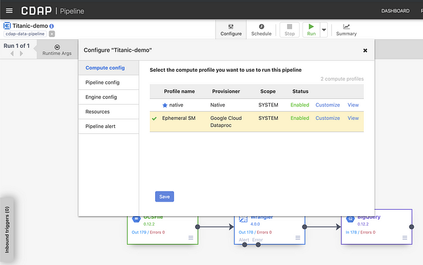
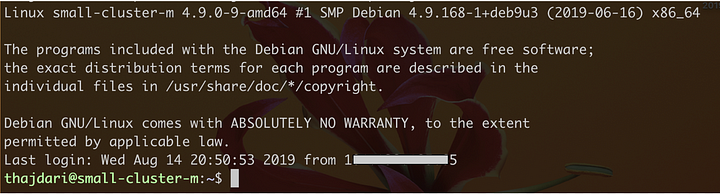

+++
author = "Veton Hajdari"
title = "Develop Locally, Deploy Globally - Part 2 "
date = "2019-08-19"
tags = [
    "CDAP",
    "Develop Locally",
    "Deploy Globally",
    "Sandbox",
    "Wrangler",
    "GCP",
]
description = "Part 2 — Running your Data processing jobs in the Cloud"
aliases = ["develop-locally-deploy-globally-2"]
image = "photo-1.png"
type = "blog"
+++

-------------------------------------------------------

In the [previous blog](/blogs/develop-locally-deploy-globally/) we learned how we can develop a pipeline locally using CDAP and how to deploy it to [Cloud Data Fusion](https://cloud.google.com/data-fusion/) (CDF) to process data via Dataproc. In this article we’ll look at how we can leverage CDAP’s compute profile so that we can run a pipeline on a remote Hadoop cluster either from a local CDAP instance or from Data Fusion, with both ephemeral and non-ephemeral clusters.

[CDAP](https://cdap.io/) supports two [profile types](https://docs.cask.co/cdap/develop/en/developer-manual/cloud-runtimes/index.html) for compute resources, ephemeral clusters and remote clusters. An ephemeral cluster is created for the duration of the data processing job and is promptly terminated once the job completes. A remote cluster on the other hand is a pre-existing, non-ephemeral or long-lived cluster, that stays on continuously and awaits requests for data processing jobs.

We’ll use the same exact pipeline we created in the previous article and deploy it to [Dataproc](https://cloud.google.com/dataproc/) for processing in both ephemeral and non-ephemeral clusters.

Cloud Dataproc Setup
--------------------

The use case for having a non-ephemeral cluster can vary from having a predictable configuration to reduced latencies for job start times. For real-time workloads this is a critical important as you may want a cluster that is aways up and running and is available to crunch data as soon as it becomes available.

Create a non-ephemeral Dataproc cluster
---------------------------------------

To start off with let’s create a non-ephemeral Dataproc cluster on GCP. Navigate to the Dataproc console and create a new cluster consisting of one master and four worker nodes. If you prefer to use the [gcloud](https://cloud.google.com/sdk/gcloud/) CLI simply enter the following command, and make sure you update the project ID with your own ID. The name I’ve given to this cluster is “**small-cluster**.”

> gcloud beta dataproc clusters create **small-cluster** — enable-component-gateway — region us-central1 — subnet default — zone “” — master-machine-type n1-standard-4 — master-boot-disk-type pd-ssd — master-boot-disk-size 500 — num-workers 4 — worker-machine-type n1-standard-4 — worker-boot-disk-type pd-ssd — worker-boot-disk-size 500 — image-version 1.3-deb9 — project **your\_projectoject\_id**

You can create a cluster of any size, depending on your needs, but you must have at least 1 master and 2 worker nodes. For this test I’ll create a small cluster consisting of 1 master and 4 worker nodes, as illustrated below.

Once your cluster has been created it will be ready to start accepting jobs for data processing. Take note, you will need to come back to this console screen later to retrieve the public IP address for the master node.

Next we need to create a compute profile that we’ll use for data processing. Compute profiles use a cloud provisioner to create an ephemeral cluster in the cloud, or to connect to a non-ephemeral cluster either in the cloud or on-prem. In this case we’ll be strictly focusing on cloud, hence all our configurations will include Dataproc. The following steps will be done on your local CDAP instance, but the steps to create a compute profile on Data Fusion are identical and you can repeat the same steps there as well.

Cloud Provisioners
------------------

In the previous section we created a Dataproc cluster on GCP that we’ll be able to submit data processing jobs to. In the next two sections we’ll create two compute profiles, one for an ephemeral cluster and one for a non-ephemeral cluster. Once again, the steps are identical in Cloud Data Fusion, so you can repeat the same exact steps there.

Ephemeral Cluster
-----------------

In CDF you will have an ephemeral profile created by default, so you can skip this step. The default profile consists of rather small cluster, so if you need different sized clusters for daily, weekly, or monthly processing cycles, make sure to create additional compute profiles and size them accordingly.

Navigate to **_Configuration_** page on your local CDAP instance ([http://localhost:11011/cdap/administration/configuration](http://localhost:11011/cdap/administration/configuration)) and click on the **_Create New Profile_** button. You can get there by clicking on the **_System Admin_** link on the top right of the page, followed by the **_Configuration_** link.

Once you click on the **_Create New Profile Button_**, the following page will appear with three selectable provisioners. Select **_Google Cloud Dataproc_** from the list of options.

In the configuration form you will select the number of nodes for masters and workers, and the resources you require in terms of CPU, RAM, and disk. For the **_GCP Account Information_** section you will need to supply your project ID, as you’ve done before, but more importantly you will need to locate the JSON file you downloaded which contains you service account details and copy the contents of that file into the **_Service Account Key_** field.

Save the profile and navigate to the pipeline you created previously ([http://localhost:11011/pipelines/ns/default/view/Titanic-demo](http://localhost:11011/pipelines/ns/default/view/Titanic-demo)).

In the pipeline runtime window click on the **_Configure_** button as shown, and select the newly listed compute profile. In my case it is called **_Ephemeral SM_**. Click the **_Save_** button to set it as the active compute profile for this pipeline.

You can now click on the **_Run_** button to execute the pipeline in the Dataproc cluster that CDAP will create for you automatically. Since our pipeline had macros for a number of settings, we’ll need to provide the values that will work effectively in the context of the cloud runtime.

Because we provided the service account information in the compute profile, this information will be automatically picked up by Dataproc when running the pipeline, so make sure to set the value for the project ID and service account to **auto-detect**.

Once the pipeline starts running you may observe that a new Dataproc cluster was created, and you can monitor its status on the GCP console.

Non-Ephemeral Cluster
---------------------

1\. Configure SSH
-----------------

Before we create the profile for the remote Hadoop provisioner, we have to make sure that we have a few configuration setting in place first. CDAP will use SSH to connect to the remote Hadoop cluster, a.k.a. non-ephemeral Dataproc cluster, so we need to make sure that the master node is accessible over SSH. To do so we first need to create an SSH key and copy the public key to the GCP console.

Mac or Linux users can use the following command to create a valid SSH key (hit enter twice to skip the passphrase):

> ssh-keygen -m PEM -t rsa -b 4096

This will create two files in the **.ssh** directory under your your **home** directory, e.g.:

> /Users/thajdari/.ssh/id\_rsa
> 
> /Users/thajdari/.ssh/id\_rsa.pub

Navigate to the **_Metadata_** section of **_Compute Engine_** and in the **_SSH Keys_** section click the **_Edit_** button and paste in the contents of your public key. This is the **id\_rsa.pub** file. Your newly deployed key will appear in the SSH Keys list.

You will now need the public IP address of the master node of the Dataproc cluster in order to test SSH connectivity with your new key. Locate the master node from the **_Cluster details_** screen for the cluster named “**small-cluster”** that was created earlier. The name of the master node for this cluster is **small-cluster-m.** The role for this VM instance is identified as master, and there is an SSH option next to the instance that tells us this is the node we can connect to.

Click on the master node to view its configuration details and make note of the external IP address.

Let’s test SSH connectivity. Type in the following command in a terminal and make sure to replace the username and IP address accordingly:

> ssh -i id\_rsa **username**@**ip\_address**

If all goes well you should be logged in to the master node and your terminal will look something like this:

2\. Set up a Remote Hadoop Provisioner
--------------------------------------

Now that SSH connectivity is confirmed let’s configure the remote Hadoop provisioner. Locate the private SSH key you created earlier (id\_rsa) and [**cat**](https://en.wikipedia.org/wiki/Cat_(Unix)) the contents to the terminal. Copy all the contents of the output, everything between and including the following text:

> — — -BEGIN RSA PRIVATE KEY — — -  
> MIIJKAIBAAKCAgEA1OQm+CBnODbWbjytsA2LWeolNLYxHyfDwKZcri9Kzh
> 
> …
> 
> DUK9Pc6TfR1x9CC8/EBdxajKKExemaWlNwxFpWoW2U9utYp74PYC4Igvg=  
> — — -END RSA PRIVATE KEY — — -

As before, navigate to compute profile configuration page ([http://localhost:11011/cdap/administration/configuration](http://localhost:11011/cdap/administration/configuration)), but this time select the **_Remote Hadoop Provisioner_** profile. Fill in the form fields as required and paste in the full contents of the private SSH key you copied previously. The **_host_** field will contain the pubic IP of the master node you retrieved earlier, and the **_user_** field will contain the same user name that your SSH key is associated with. If you are unsure what that username is, look at your id\_rsa.pub key, or the Metadata screen on the GCP console where you deployed your public key. You will find the user name towards the end of the id\_rsa.pub file.

As you may have deduced, this provisioner can be used with other Hadoop clusters, not just Dataproc. In a future article I’ll discuss how you can connect to clusters running Cloudera or Hortonworks.

In your compute profiles list you will now see the new entry. You are now ready to submit jobs to the remote Hadoop cluster — Dataproc.

As before, to use the new profile you created when you run the pipeline, make sure to click the **_Configure_** button, select the profile to use, and click **_save_**. When you click **_run_** the job will be submitted to the non-ephemeral cluster.

Conclusion
----------

In the last blog we learned how we can develop pipelines locally and deploy them to a managed instance of CDAP in the cloud — CDF. We used CDF to run the pipeline and it automatically took care of provisioning a Dataproc cluster for us. We also learned how we can leverage the power and scalability of Dataproc right from our own machine by running the pipeline locally and having Dataproc do all the heavy lifting for us.

CDF’s UI for configuring compute profiles is identical to CDAP’s so the same steps can be followed in either environment.

The benefits of having access to both ephemeral and non-ephemeral clusters is that you can associate processing resources with individual pipelines. For realtime workloads you may have a non-ephemeral cluster, which is always up and running, that you can associate with your realtime pipelines. For times when you need to process different volume of data, like in daily, weekly, or monthly jobs, you may want to allocate different processing resource to address the data volume or shorten the length of time it takes to process that data.