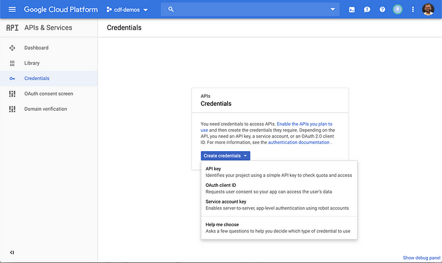

+++
author = "Veton Hajdari"
title = "Develop Locally, Deploy Globally"
date = "2019-07-30"
tags = [
    "CDAP",
    "Develop Locally",
    "Deploy Globally",
    "Sandbox",
    "Wrangler",
    "GCP",
]

aliases = ["develop-locally-deploy-globally"]
image = "photo-1.png"
type = "blog"
+++


One notable advantage of working with CDAP is that you can build data integration pipelines locally on your own computer, with a local instance of CDAP Sandbox, and you can deploy those pipelines to run either in the cloud or on a remote Hadoop cluster.

In this article I’ll show you how to use CDAP with the Google Cloud Platform (GCP) so that you can create pipelines on your own machine and run them in the cloud with [Dataproc](https://cloud.google.com/dataproc/), Google’s managed service for Apache Hadoop & Apache Spark. I’ll also show you how to deploy the pipeline to [Data Fusion](https://cloud.google.com/data-fusion/), the managed service offering of CDAP on GCP, for centralized management and execution.

Install CDAP Sandbox
--------------------

To get started follow the instructions in the linked blog post to set up your local sandbox version of CDAP — “[How to Install and Configure CDAP Sandbox Locally](/how-to-guides/how-to-install-and-configure-cdap-sandbox-locally/).”

With CDAP configured and working locally we now turn our attention to configuring access to GCP. To use GCP resources you’ll need to configure IAM access via a service account.

Log in to your [GCP console](https://console.cloud.google.com/) and navigate to **_API’s & Services_**, select **_Create credentials_**, and choose **_Service account key_**.



In the next dialog choose **_Compute Engine default service account_** and make sure that **_JSON_** is selected.


This process will generate a JSON file with the credentials that will be used to access the GCP services. Make sure to store this file in a secure location on your computer.


Configure Wrangler Connections
------------------------------

Next we’ll configure CDAP with the service account so that we can access the GCP services from our local CDAP instance. This will also help us validate that the service account is working properly with GCP.

Navigate to Wrangler and click the **_Add Connection_** button. Choose **_Google Cloud Storage_** from the list of options, and you will be presented with a configuration dialog. The last field will reference the physical path where you downloaded the JSON file with your service account credentials. In my case it is located in the path illustrated below:

> /Users/thajdari/apps/cdap/GCP/cdf-demos-528813a2376c.json


**_Connection name_** is a simple text string that describes what this connection will be displayed as in Wrangler. You can set this to whatever you like. You can retrieve the **_Project ID_** from your GCP console. Make sure to use the value from the ID field.


Fill in the form fields as illustrated.


Once the form fields are filled in you can test the configuration to make sure that the connection to GCP works properly with your newly created service account. After a successful test you can click the **_Add Connection_** button to save the configuration. You can repeat the same process to add connections to other GCP resources like BigQuery or Spanner.

You can now navigate your Google Cloud Storage data right from your local CDAP instance.


**Build and Test your Pipeline**
--------------------------------

Build a pipeline and test it in preview mode. If your permissions are set correctly in IAM your pipeline should run successfully. If you encounter any errors with permissions make sure that you grant the appropriate roles to the service account in IAM.


To make the pipeline portable set the plugin fields that reference the project and service account settings to macros in order to define them globally. This will make it easy to use automatic account detection once we move the pipeline to the cloud and run it in [Data Fusion](https://cloud.google.com/data-fusion). In my case the settings are as follows:

```
${project.id} => cdf-demos-239516
${service.account.file.path} => /Users/thajdari/apps/cdap/GCP/cdf-demos-528813a2376c.json
```


As a final step set the execution engine to Spark so that the pipeline will later use Apache Spark for data processing when it runs on Dataproc.


Deploy to Cloud Data Fusion on GCP
----------------------------------

At this stage you should have a pipeline that is working properly on your local CDAP sandbox instance. Now let’s deploy the pipeline to a Data Fusion instance running on GCP. If you have not already done so, [create a Data Fusion instance](https://cloud.google.com/data-fusion/docs/how-to/create-instance).

Export your pipeline from the local CDAP sandbox instance and import the pipeline JSON from the previous step onto Data Fusion. When the pipeline is imported Data Fusion will examine the pipeline and recommend any fixes that need to be applied. This ensures that if there are discrepancies in plugin versions between your local CDAP sandbox instance and Data Fusion, the pipeline will be updated to use the versions of the plugins that are available in the cloud instance. Click on **_Fix All_** to continue with the pipeline import.


**Test the Pipeline on Data Fusion**
------------------------------------

With the pipeline deployed to Data Fusion you can now test the pipeline running in the cloud. Since the project id and service account fields were set as macros on the plugins that relied on them, the UI will provide input fields to supply the new values. Account settings are automatically picked up by Data Fusion for the project you are running on so all you need is to set the value for the project id and service account macros to **auto-detect**.


Process the Data with Dataproc
------------------------------

You can now deploy the pipeline and run it using the default Dataproc profile. Dataproc will create an ephemeral cluster and use the Apache Spark processing engine to process the data.


Conclusion
----------

Building data integration pipelines locally and deploying for execution in the cloud allows for a much more agile development experience since the behavior of the sources, transforms, and sinks are identical in both modalities. CDAP pipelines are portable from environment to environment and the UI provides helpful feedback to identify where upgrades will take place and accommodate environment specific configurations.

In a future article I’ll discuss how you can leverage CDAP sandbox to develop your pipeline locally and use Google Dataproc for data processing in the cloud using both ephemeral and long-running clusters by leveraging CDAP’s compute profiles.