+++
author = "Veton Hajdari"
title = "Getting started with CDAP plugin development"
date = "2019-12-02"
tags = [
    "Java",
    "Cdap",
    "Big Data",
    "Open Source",
]
aliases = ["cdap-plugin-development"]
image = "cdap-logo.png"
type = "blog"
+++

One of my favorite features of CDAP is that the extensibility of the platform allows you to add new functionality yourself. If you need to perform a transformation, or need to source or sink data to or from a system that is not currently available in the plugin ecosystem, you can easily add your own plugin to provide that capability.

Getting started with plugin development is as simple as cloning one of the example plugins and modifying it to add your own implementation logic. In this article I will cover what you’ll need to know to get started with plugin development. I’ll discuss the key configuration elements that you need to be familiar with so you can iterate over the development of the plugin.

Prerequisites
-------------

When writing plugins for CDAP you will need a collection of tools to help you develop, organize, build, and run your code. For this we’ll be relying on a number of tools: **Git, Java 8, IntelliJ IDE,** and **Maven**.

Fist step is to make sure you have Java 8 SDK installed on your computer. To check which version of Java you have run the following command in a terminal:

> **java -version**

If your computer has a newer version of Java you will need to install a version of Java 8 SDK. You can download this from the Java [web site](https://jdk.java.net/java-se-ri/8)[,](https://jdk.java.net/java-se-ri/8,) and we’ll use it later in the Java IDE for you project.

If you are on Linux you can install it with your package manager, Yum or APT, for Centos/RedHat or Debian/Ubuntu, respectively. For installing Java on a Mac with Homebrew you can use the following commands:

> brew tap AdoptOpenJDK/openjdk
> 
> brew cask install adoptopenjdk8

If you have the latest version of Java on your Mac and have issues changing the version of Java to 1.8 then refer to this [Stack Overflow article](https://stackoverflow.com/questions/21964709/how-to-set-or-change-the-default-java-jdk-version-on-os-x/24657630#24657630).

For writing the actual plugin code we’ll use the IntelliJ Java IDE which you can download from [here](https://www.jetbrains.com/idea/).

Once our code is written, we’ll use Maven to build the plugin so that we can test it on CDAP. You can download Apache Maven from [here](https://maven.apache.org/download.cgi). After you’ve downloaded Maven extract it to a directory of your choice and set your PATH environment variable so that it is available globally in your terminal. In my case my **_.bash\_profile_** file has the **_PATH_** variable set as follows:

> export PATH=$PATH:/Users/vetoni/apps/tools/apache-maven-3.6.2/bin

With the environment setup we can now use Git to clone the sample-transform plugin form the repo with the following command:

> git clone [https://github.com/data-integrations/example-transform.git](https://github.com/data-integrations/example-transform.git)

Git will create a folder named **_example-transform_**, and in that folder you will find a **pom.xml** file. We will use this file to load up the project in IntelliJ. Launch IntelliJ and select **_open_**, and make sure to choose **_Open as Project_**.

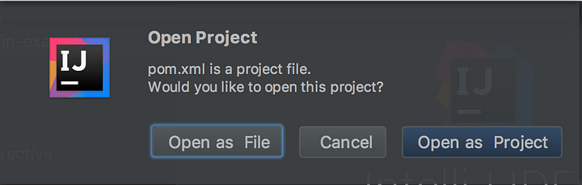

After IntelliJ finishes loading all the dependencies you will see a list of directories created with the components that we’ll be using in this tutorial.

The screen will look something like this:

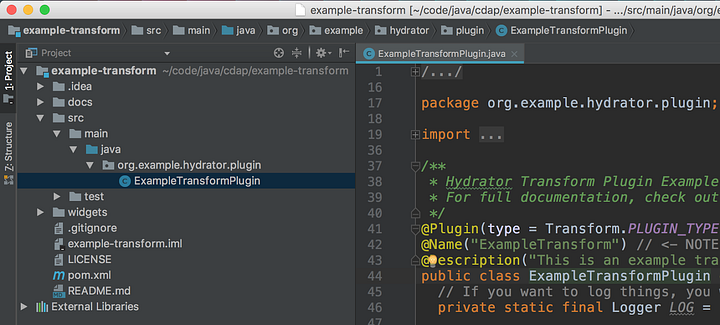

The plugin in its current state is ready to be built, so you can try building it to make sure that Java 8 and Maven are working happily together. First check to make sure that you have set your Java version to 1.8. From **_file_**, select **_project structure_** and take note of the Java version listed for the **_Project SDK_**.

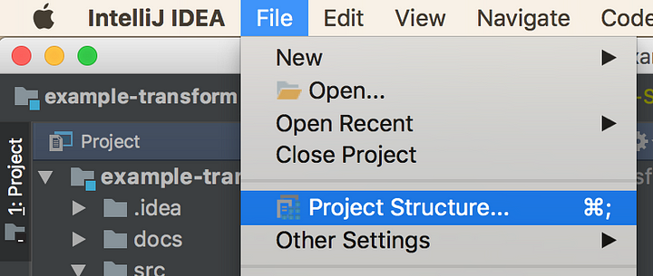

If you don’t see Java 1.8 listed in the dropdown you can add it to the project by clicking the **_New…_** button and selecting JDK.

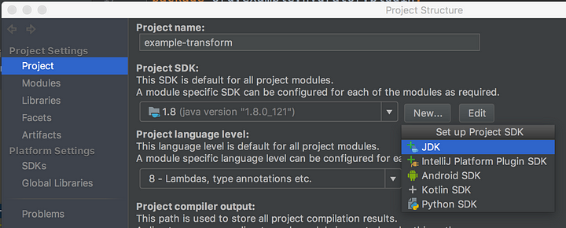

Pick the location where you downloaded your Java 8 SDK earlier. On my machine Java 8 is located at the following location :

> /Library/Java/JavaVirtualMachines/jdk1.8.0\_121.jdk/Contents/Home/

You are now ready to test building the plugin. On the right hand side of the screen you can select the **_Maven Projects_** tab and select **_package_** from the list of Lifecycle commands.

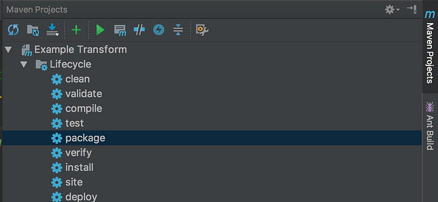

This will invoke the Maven build, test and package targets and create a new **_target_** directory with the JAR file containing the plugin — **example-transform-1.1.0-SNAPSHOT.jar**.

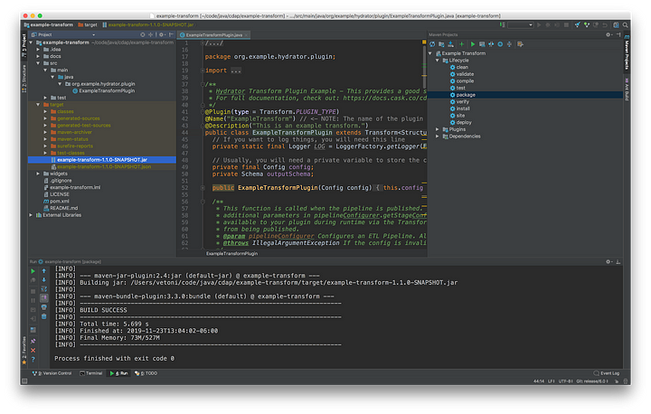

Project Structure
-----------------

Before getting started with the actual coding, let’s take a look at the project structure for the plugin. The plugin has a number of files that need to be updated according to your specific needs. Looking at the folder structure you can see the four directories that contain the files we need to modify.

*   **docs** → ExampleTransform-transform.md
*   **icons** → ExampleTransform-transform.png
*   **src** → ExampleTransformPlugin.java
*   **widgets** → ExampleTransform-transform.json

In each of these directories, with the exception of the src folder, you will see a file named with the following pattern:

> **`<PluginName>-<pluginType>.<fileType>`**

Take note that the icons folder is optional, so when you first clone the repo you will not see the folder in your project structure. If you don’t create the folder and provide your own 64x64 pixel icon, CDAP will provide a generic plugin icon for you. For this tutorial I’m going to supply my own plugin icon.

In the Java class you will notice there is a **_@Name_** annotation that matches the prefix for all the files used in the directories mentioned above. Pay close attention to the name of the plugin as this is where you may run into issues later on as you refactor the code to change the plugin name.

> **NOTE:** The plugin name, as specified via the @Name annotation, must match the file prefixes in docs, icons, and widgets directory.

At the root directory we also have the **README.md** file that provides information and any documentation you may want to provide to users, as well as the **pom.xml** file that is used to build the plugin artifacts.

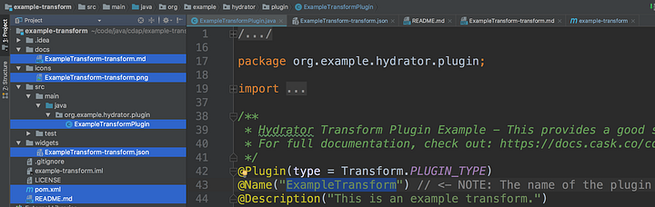

We are now ready to start customizing the **ExampleTransform** plugin and modify it to suit your needs.

I’ll start will some refactoring so that the plugin will reflect the intent of the implementation. First I’m going to modify the **pom.xml** and update the following properties with my own values.

> groupId → io.cdap.hydrator.plugins
> 
> artifactId → simple-mask
> 
> version → 1.0.0-SNAPSHOT
> 
> name → Simple Mask
> 
> exported-packages → io.cdap.hydrator.plugin.\*

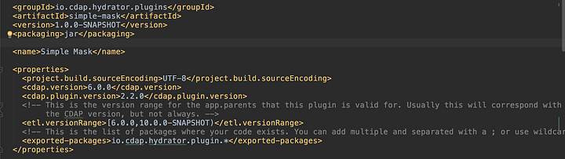

For this plugin we are going to implement a super simple Rot13 Caesar cipher to obfuscate text data. This cipher simply takes some input text and jumbles the text using the Rot13 algorithm. To help us with the actual implementation we’re going to leverage a pre-existing library that provides us a Rot13 implementation, and were simply going to add it to our pom.xml file.

Add the following XML snippet to your dependencies section.

> <! — [https://mvnrepository.com/artifact/org.soulwing/rot13](https://mvnrepository.com/artifact/org.soulwing/rot13) →
> 
> <dependency>
> 
> <groupId>org.soulwing</groupId>
> 
> <artifactId>rot13</artifactId>
> 
> <version>1.0.0</version>
> 
> </dependency>

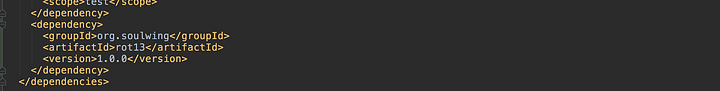

IntelliJ will download the dependencies and you will be able to use the cipher classes in your code.

Refactor
--------

Now we can start refactoring the files I discussed earlier. In IntelliJ you can use Shift+F6 to rename the files, package (folder), and class to **SimpleTransform**. I chose to name it something more generic so I can come back to it in the future and add more Caesar ciphers. Later I will refactor this plugin once more to change its name.

After you refactor the project files will look as follows:

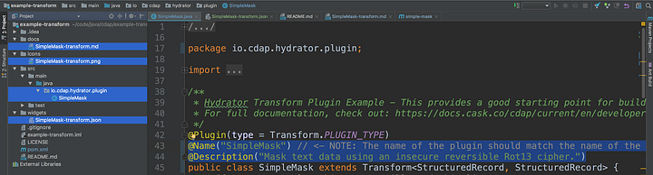

Now’s a good time to build the project once again to make sure that nothing is broken. From the terminal you can run the following command to build the project:

> **mvn clean package**

When the build runs, it will scan the **widgets** and **docs** directories in order to build an appropriately formatted **.json** file under the \`**target\`** directory. This file is deployed along with your **.jar** file to add your plugin to CDAP.

We can see Maven creates a target directory where we can find the plugin artifacts:

**\-> simple-mask-1.0.0-SNAPSHOT.jar**

**\-> simple-mask-1.0.0-SNAPSHOT.json**

We can now deploy the plugin to see what it looks like in CDAP Studio. Launch CDAP studio and click on the green plus icon and upload the plugin as illustrated.

Time to Code
------------

We now have all the prep and setup work out of the way, and we have validated that the plugin compiles and loads into CDAP correctly. Now we can turn our attention to coding. In the next step we’ll write the logic for the transform plugin that takes text as input and generates scrambled text as output. Along the way I will refactor the code as I go so that it matches my requirements and will rename the plugin to **ScrambleText** so that its intent and purpose is absolutely clear.

All plugins have an API that includes a number of annotations as well as some configuration, initialization, validation, and depending on the plugin type, a method that implements the plugin’s core functionality. In this case, the majority of the implementation for a transform plugin in done in the **transform()** method. For further details on the various plugin types that you can build and how the API works please refer to the [CDAP documentation page](https://docs.cdap.io/cdap/6.0.0/en/developer-manual/pipelines/developing-plugins/creating-a-plugin.html#H2614) for reference.

Replace this section of code…

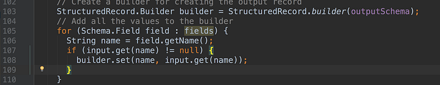

So that it looks like the following snippet.

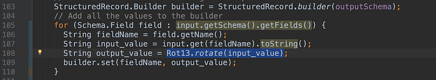

As you can see we make use of the Rot13 class to convert the input string and set it to the output value for that record. IntelliJ should auto import the class for you when you use this class.

Next, we need to handle user input from the plugin configuration in CDAP studio. Input that is collected from the user will dictate how the plugin needs to behave and what output it should generate. Input validation is another important function that needs to be performed as you can never be sure that you will be getting valid data from a user. The degree as to how you configure your widgets and how you handle use input is totally up to you and what features you want to include in your plugin. For this example we’re going to keep it as simple as possible just to illustrate the concepts. For now make sure your config class looks like the following illustration:

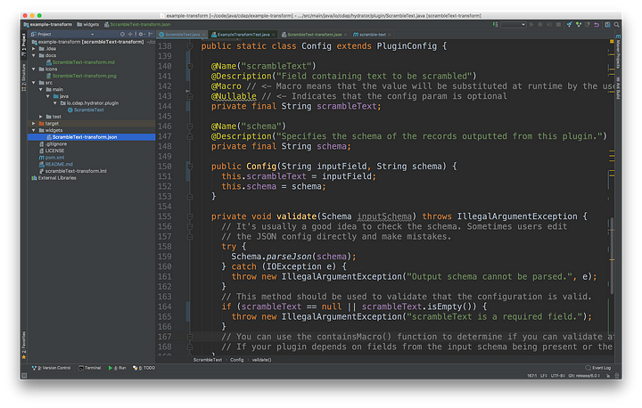

Now we can turn out attention to customizing the plugin configuration form so that it looks like the following illustration. Plugin presentation is configured in the widget JSON file. Refer to the CDAP documentation for all the [presentation widgets](https://docs.cdap.io/cdap/6.0.0/en/developer-manual/pipelines/developing-plugins/presentation-plugins.html) that you can use in your plugins.

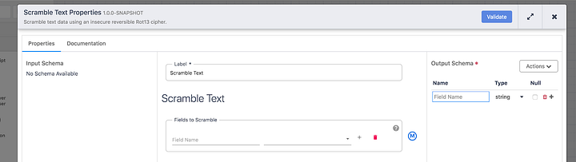

Replace the contents of the widgets JSON file with the following, and take note of the **name** used for the KeyValue widget as this is the variable that is used in the **Config** section of the code to work with form inputs.

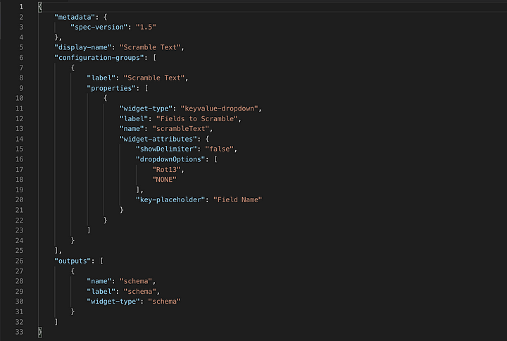

Right now the plugin doesn’t do much validation, and it only looks for the existence of an input field that will contain text to be scrambled. It will take all the fields from the previous stage and apply the Rot13 algorithm to generate scrambled output tex. At this point you’ll need to either comment out the code in the test class, as it will fail to build, or skip the tests for now when running the Maven build.

Finally, time to test the plugin in CDAP studio. At this stage of the plugin’s evolution it should be able to take input from a node in a pipeline, scramble the text, and output the scrambled text to the next node in the pipeline. There is only one validation that the plugin performs — it checks for the existence of a **scrambleText** input from the plugin configuration. Even though the plugin does not actually do anything with this data it needs to be provided in the plugin configuration in order for the plugin validation to succeed.

Looking Ahead
-------------

There is still more to be done! As an exercise, I leave up to you to expand upon the code to add the form validation as well as select the input fields the plugin will operate upon.

Further enhancements you can consider would be to include additional ciphers that the user can select from the drop-down. You will also need to update the test class to match the inputs, transformations, and outputs you want this plugin to test.

Summary
-------

In this article we reviewed the steps required to get started with plugin development. There are a number of example plugins that can be cloned from the [data-integrations](https://github.com/data-integrations) GitHub repo that provide a quick start to plugin development. Using the sample plugin as a starting point for your custom plugin saves you from having to code all the boilerplate, and you’ll have all the requisite classes and methods in place to give you a springboard into development.

There are over a dozen plugin types available in CDAP. Although we did not go into any details of the Plugin API itself, the plugin API is fairly well documented on CDAP’s [documentation](https://docs.cdap.io/cdap/6.0.0/en/developer-manual/pipelines/developing-plugins/index.html) page, so that you can dive deeper into the API on your own and learn about all the different types of plugins you can build.

Testing you plugin is also an important part of the development process, but that’s a topic for another blog article. In future articles we’ll look at plugin validation and testing in grater detail.

Hopefully this has given you sense of how to get started with developing plugins for CDAP. So, jump right in and create a few cool plugins of your own. Happy coding!