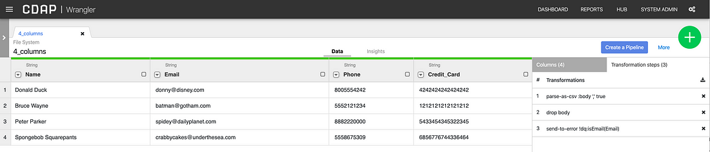
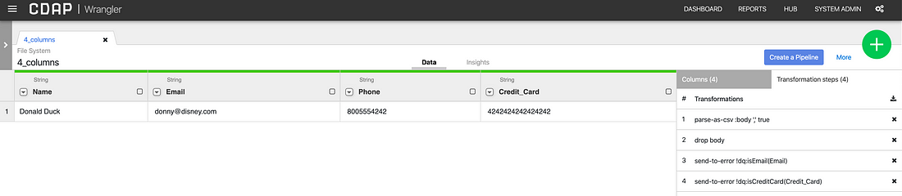

+++
author = "Veton Hajdari"
title = "Wrangler Functions Cheat Sheet"
date = "2020-02-11"
tags = [
    "CDAP",
    "Big Data",
    "Etl",
    "Java Expressions",
    "Data Analytics",
]
aliases = ["wrangler-functions-cheat-sheet"]
image = "photo-1.png"
type = "blog"
+++

To really become a Ninja with Wrangler Directives you have to get to know all the functions that Wrangler supports. In this article I’m going to list out all the Wrangler functions with a short description of what each one does.

At the time of this writing the Wrangler code branch on GitHub is at version 4.1 for the latest release. The link to the Wrangler functions documentation can be found [here](https://docs.cdap.io/cdap/current/en/user-guide/data-preparation/functions/index.html).

In a [previous article](/blogs/advanced-cdap-directives/) I discussed how you can use JEXL expressions in your directive, and these functions are no different. This article will primarily focus on the functions themselves, so that you have a good understanding what is available.

If you want to know what JEXL function types are available to Wrangler you can take a look at the code [here](https://github.com/data-integrations/wrangler/blob/release/4.1/wrangler-core/src/main/java/io/cdap/wrangler/expression/EL.java), but, I’ll save you the trouble and list them here along with their associated Classes.

**Function Prefix → Class Name**  
_null_ → Global.class  
_date_ → Dates.class  
_json_ → JSON.class  
_dq_ → DataQuality.class  
_ddl_ → DDL.class  
_geo_ → GeoFences.class

… and a few more that are not covered in this blog! The rest of the functions allow you to call methods from the corresponding Java utility classes like Math, Sting, etc — more on this in future articles, so keep an eye out! But, for the impatient here’s now such a function would be used:

> set-column :rounded\_price math:ceil(price)

_math_ → Math.class  
_string_ → StringUtils.class  
_strings_ → Strings.class  
_escape_ → StringEscapeUtils.class  
_bytes_ → Bytes.class  
_arrays_ → Arrays.class

Using Functions
---------------

Most commonly you will use these functions with a directive that can parse an expression, such as **send-to-error**.

> **send-to-error _exp:{<condition>}_**

So, in order to use an expression you put the prefix in the **exp** part of the expression, unless it’s the Global variety, in which case you leave it empty. This would take the form of: FUNCTION(), date:FUNCTION(), dq:FUNCTION(), json:FUNCTION(), and so on.

For example, a directive that uses the Data Quality function would look like this:

> _send-to-error_ **_dq:isCreditCard(Credit\_Card\_Number)_**

As you can see in this example, **dq** is the function prefix and **isCreditCard()** is the function that is part of the Data Quality class, using the “**:”** to concatenate the expression.

This function checks to see that the value in the column “**_Credit\_Card\_Number_**” is in fact a valid credit card number.

Conversely, you can check for the inverse condition by prefixing the function name with a “!” — this is the result of the function evaluating to false.

> _send-to-error_ **_!dq:isCreditCard(Credit\_Card\_Number)_**

The following screenshots illustrate what happens to the record that are filtered out that have invalid credit card numbers.

Additionally, you can also use these functions with the **set-column** directive, to create a new column based on an expression applied on one or more other columns.

> **set-column** **_:column-name exp:{<condition>}_**

For example,

> _set-column :Full\_Name_ **string:concat(first, ‘ ‘, last)**

The following cheatsheet lists the functions along with the data type it accepts as input. The source code for all these functions can be found [here](https://github.com/data-integrations/wrangler/tree/release/4.1/wrangler-core/src/main/java/io/cdap/functions).

Global Functions
----------------

In this section the functions do not have a prefix (_null_ → Global.class), therefore you do not put anything before the function.

Conversion Functions
--------------------

_Example_: **set-column :Phone1 toDouble(Phone)**

*   **toDouble**(String value) → Converts String value to double.
*   **toFloat**(String value) → Coverts a String value to float.
*   **toLong**(String value) → Converts a String value to Long.
*   **toInteger**(String value) → Converts a String value to integer.
*   **toBytes**(String value) → Converts a String value to byte array.

String Utility Functions
------------------------

_Example_: **set-column Salutation concat(“Mr. ”, Name)**

*   **concat**(String a, String b) → Concatenates two string without any separator in between.
*   **concat**(String a, String delim, String b) → Concatenates two string with a delimiter.
*   **coalesce**(Object … objects) → Finds the first non-null object.
*   **rcoalesce**(Object … objects) → Finds the last non-null object.
*   **format**(String str, Object… args) → Formats the string in way similar to JAVA’s String format.
*   **padAtStart**(String string, int minLength, char padChar) → Returns a string, of length at least minLength, consisting of string prepended with as many copies of padChar as are necessary to reach that length.
*   **padAtEnd**(String string, int minLength, char padChar) → Returns a string, of length at least minLength, consisting of string appended with as many copies of padChar as are necessary to reach that length.
*   **repeat**(String string, int count) → Returns a string consisting of a specific number of concatenated copies of an input string.
*   **unquote**(String string) → Removes single or double quotes from a string if its quoted.

Data Quality Functions
----------------------

Data quality functions validate the data being passed in, so **send-to-error** or **filter-\*** type directives are good options to use in combination with these functions.

_Example_: **send-to-error !dq:isEmail(Email)**

*   **columns**(Row row) → Given a row, finds the length of the row
*   **hascolumn**(Row row, String column) → Finds if the row has a column.
*   **inrange**(double value, double lower, double upper) → Checks if the value is within the range.
*   **strlen**(String str → Returns the length of the string.
*   **isnull**(Object object) → Checks if the object is null.
*   **isempty**(String str) → Checks if the string is empty.
*   **isDate**(String date) → Validate using the default Locale.
*   **isDate**(String date, String pattern) → Validate using the specified pattern.
*   **isNumber**(String str) → Checks if a value is a number.
*   **isBoolean**(String str) → Checks if a value is a boolean.
*   **isEmpty**(String str) → Checks if a value is a empty
*   **isDouble**(String str) → Checks if a value is a double.
*   **isInteger**(String str) → Checks if a value is an integer.
*   **isIP**(String ip) → Checks if string is a valid IP address. Could be IPv4 or IPv6.
*   **isIPv4**(String ip) → Checks if string is a valid IPv4 address.
*   **isIPv6**(String ip) → Checks if string is a valid IPv6 address.
*   **isEmail**(String email) → Checks if string is a valid email address.
*   **isUrl**(String url) → Checks if string is a valid url address.
*   **isDomainName**(String domain) → Checks if string is a valid url domain.
*   **isDomainTld**(String domain) → Checks if string is a valid top-level domain.
*   **isGenericTld**(String domain) → Checks if string is a valid generic top-level domain.
*   **isCountryTld**(String domain) → Checks if string is a valid country top-level domain.
*   **isISBN10**(String isbn) → Checks if string is a valid ISBN-10.
*   **isISBN13**(String isbn) → Checks if string is a valid ISBN-13.
*   **isCreditCard**(String cc) → Checks if string is a valid credit card number.
*   **isAmex**(String cc) → Checks if string is a valid AMEX credit card number.
*   **isVisa**(String cc) → Checks if string is a valid VISA credit card number.
*   **isMaster**(String cc) → Checks if string is a valid Master Card credit card number.
*   **isDiner**(String cc) → Checks if string is a valid Diner’s Card card number.
*   **isDiscover**(String cc) → Checks if string is a valid Discover Card number.
*   **isVPay**(String cc) → Checks if string is a valid VPay card number.

Date Functions
--------------

The majority of the functions here expect **ZonedDateTime** as input, so make sure to parse the date filed before using the functions.

_Example_:

> **send-to-error !date:isDate(Birthday)**
> 
> **parse-as-simple-date :Birthday MM/dd/yyyy**
> 
> **set-column month\_born date:MONTH\_LONG(Birthday)**

*   **UNIXTIMESTAMP\_MILLIS**(ZonedDateTime date) → Converts a date to long unix timestamp in milli-seconds.
*   **UNIXTIMESTAMP\_SECONDS**(ZonedDateTime date) → Converts a date to long unix timestamp in seconds.
*   **MONTH**(ZonedDateTime date) → Converts a ZonedDateTime to Month in year.
*   **MONTH\_SHORT**(ZonedDateTime date) → Extracts a short month description from Date.
*   **MONTH\_LONG**(ZonedDateTime date) → Extracts a long month description from Date.
*   **YEAR**(ZonedDateTime date) Extracts only year from Date.
*   **DAY\_OF\_WEEK**(ZonedDateTime date) → Extracts day of the week from the date.
*   **DAY\_OF\_WEEK\_SHORT**(ZonedDateTime date) → Extracts day of the week from the date.
*   **DAY\_OF\_WEEK\_LONG**(ZonedDateTime date) → Extracts day of the week from the date.
*   **DAY\_OF\_YEAR**(ZonedDateTime date) → Extracts Day of the year from the date.
*   **ERA**(ZonedDateTime date) → Extracts Era from the date.
*   **ERA\_SHORT**(ZonedDateTime date) → Extracts Era from the date as short text.
*   **ERA\_LONG**(ZonedDateTime date) → Extracts Era from the date as long text.
*   **DAYS\_BETWEEN**(ZonedDateTime date1, ZonedDateTime date2) → Return number of days between two dates.
*   **DAYS\_BETWEEN\_NOW**(ZonedDateTime date) → Return number of dates between now and date days.
*   **SECONDS\_TO\_DAYS**(int seconds) → Converts seconds to days.
*   **SECONDS\_TO\_HOURS**(int seconds) → Converts seconds to hours.
*   **SECONDS\_TO\_MINUTES**(int seconds) → Converts seconds to mins.
*   **SECONDS\_TO\_WEEKS**(int seconds) → Converts seconds to weeks.
*   **isDate**(String value) → Checks if a column is a date column.
*   **isTime**(String value) → Checks if the value passed is a date time.

Geo Fencing Functions
---------------------

Some Geo functions for good measure.

_Example_: **send-to-error !geo:inFence(latitude,longitude,body)**

*   **inFence**(double latitude, double longitude, String geofences) → Checks if Point is inside any of the given polygonal geofences based on the winding number algorithm.
*   **isPointInside**(Feature feature, Coordinates location) → Checks if geometry is inside the given location
*   **isLeft**(Coordinates vertex0, Coordinates vertex1, Coordinates gpC) → You’ll have to look at the source code to figure this one out!!!

JSON Functions
--------------

For those times when you need to work JSON data in a column. Make sure to parse the JSON string first with the **parse-as-json** directive for the functions that expect a **JsonElement** as input.

_Example_: **set-column character\_data json:parse(JSON)**

*   **select**(String json, String path, String …paths) → Selects elements from a JSON string.
*   **select**(String json, boolean toLower, String path, String …paths) → Selects elements from a JSON string.
*   **select**(JsonElement element, String path, String …paths) → Selects elements from a JSON string.
*   **select**(JsonElement element, boolean toLower, String path, String …paths) → Selects elements from a JSON string.
*   **drop**(String json, String field, String … fields) → Removes fields from a JSON, inline, by recursively iterating through the JSON to delete one or more fields specified.
*   **drop**(JsonElement element, String field, String … fields) → Removes fields from a JSON, inline, by recursively iterating through the JSON to delete one or more fields specified.
*   **keysToLower**(JsonElement element) → Lowers the keys of the json. it applies this transformation recurively.
*   **join**(JsonElement element, String separator) → Join two JSON elements together
*   **stringify**(JsonElement element) → Converts an JavaScript Object to a JSON string.
*   **parse**(String json) → Parses a column or string to JSON. This is equivalent to JSON.parse()
*   **parse**(String json, boolean toLower) → Parses a column or string to JSON. This is equivalent to JSON.parse()

**Conclusion**
--------------

This article listed all the functions you have available in Wrangler which can be used in directives that support expressions. You may have noticed that the **isDate** function is available in multiple classes. The one you use will depend on the type of input you are validating and the logic you are implementing.

In future articles we’ll dive a little deeper to see how we can chain such functions together and use them in combination to really spruce up our Wrangler recipes.