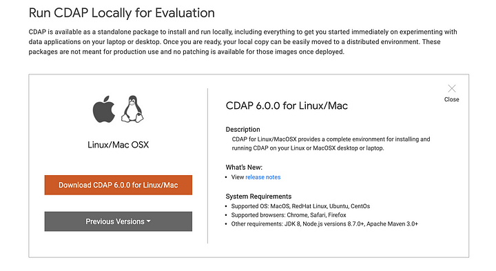
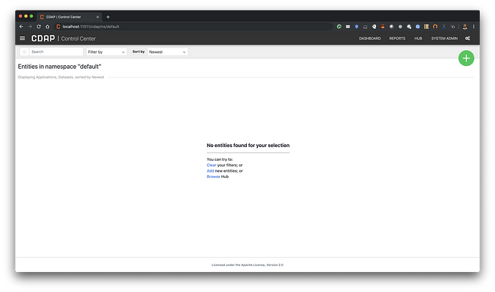

+++
author = "Veton Hajdari"
title = "How to Install and Configure CDAP Sandbox Locally"
date = "2019-06-24"
tags = [
    "CDAP",
    "Cloud Data Fusion",
    "Data Lineage",
    "Data Integration",
    "Field Level Lineage",
    "FLL",
]

aliases = ["configure-cdap"]
image = "cdap-logo.png"
type = "howtoguide"

+++

CDAP Sandbox allows you to build pipelines locally on your computer and it provides a great learning environment if you are new to CDAP. There are three varieties of CDAP sandbox that you can use locally; a Zip file archive, a VirtualBox VM, and a Docker image. If this is the first time you are setting up CDAP it may be easier to go with the Zip option as there are less components to configure and figure out. You can find the sandbox versions here: [https://cdap.io/get-started/](https://cdap.io/get-started/).

The instructions included here are for the Mac, but you should be ably to adapt them to your OS as well. The Zip archive will behave the sam way regardless of the operating system you are on. You can use [homebrew](https://brew.sh/), a handy package manager for the Mac, to install both Java and Node. I’ll spare you the details as to how to set up homebrew since there are many resources on the internet that you can refer to. Similar tutorials are available online for installing Java and Node for both Windows and Linux, so please refer to those resources for further instructions.



Step 1 — Install OpenJDK
------------------------

CDAP 6.0 requires Java 8 or higher. Once installed make sure to validate that Java 8 has been installed correctly, and that the JRE is available from your path. You might have to add the JDK path to your user profile settings depending on your OS and current setup.

```
brew tap AdoptOpenJDK/openjdk
brew cask install adoptopenjdk8
```


Step 2 — Install NodeJS
-----------------------

Use an LTS version 10.16 or newer so that you have the latest supported LTS release.

```
brew install node@10
```


Step 3 — Install CDAP Sandbox
-----------------------------

Download CDAP Sandbox 6.0 archive to your computer: [https://downloads.cask.co/cdap-sandbox/cdap-sandbox-6.0.0.zip](https://downloads.cask.co/cdap-sandbox/cdap-sandbox-6.0.0.zip)

Unzip the file to the folder of your choice, and change into the bin directory.

```
unzip cdap-sandbox-6.0.0.zip
cd cdap-sandbox-6.0.0/bin
```


Start the CDAP Sandbox:

```
./cdap sandbox start
```


Once the service has started you will see the following message on the console. You can now open your browser and navigate to the local CDAP instance on your computer.

```
Starting CDAP Sandbox .............CDAP Sandbox started successfully.
Connect to the CDAP UI at http://localhost:11011
```


Your CDAP instance will have no artifacts yet, so you will see an empty console screen.



Congratulations you have now set up CDAP locally on your computer and can now start building data pipelines.