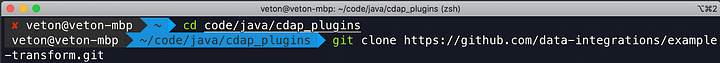
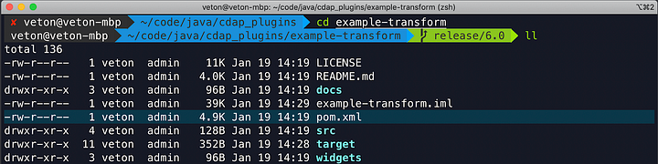
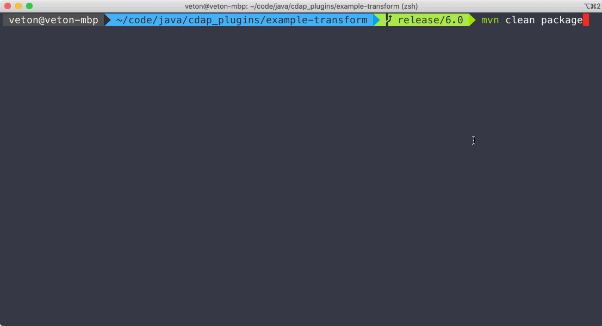
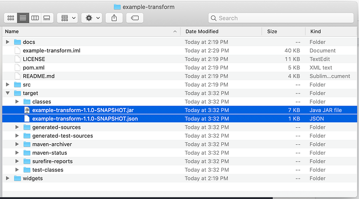
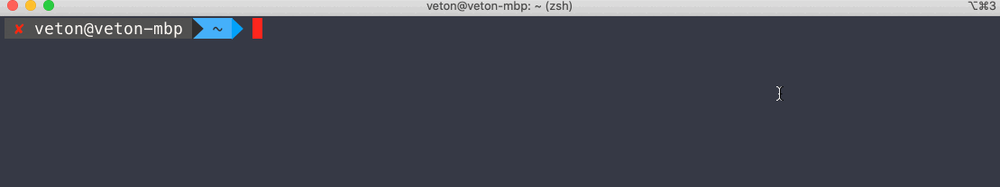
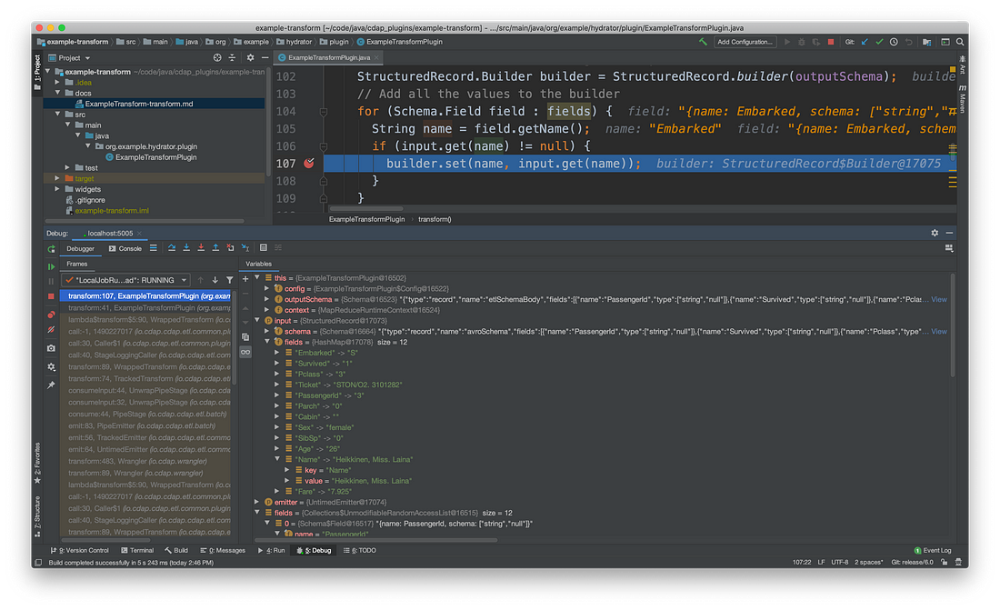

+++
author = "Veton Hajdari"
title = "How to debug your plugin"
date = "2020-01-27"
tags = [
    "CDAP",
    "Plugins",
    "Big Data",
    "Java",
    "Intellij",
]

aliases = ["debug-plugin"]
image = "photo-1.png"
type = "howtoguide"

+++

In a previous article I showed you how to get started with plugin development in CDAP. But, wouldn’t it be nice if we can attach a debugger to a deployed plugin and see how it performs inside of a pipeline with actual data?

I’m going to show you how to attach a debugger to a CDAP sandbox instance so that we can inspect the data that is being processed by the plugin. This will help us get a better sense of what the plugin is doing, and all the other interesting bits that we can observe from the objects we’ll have access to.

It’s always handy to be able to see what data is being passed along from a previous stage in a pipeline and how that data is being passed to the next stage in the pipeline. When you build a plugin it’s always best to start simple and layer on additional functionality as you go. This article builds on the knowledge from the previous plugin development article and once again I’ll use the example-transform plugin for illustration.

**Clone and Build the Plugin**
------------------------------

First, clone the [**example-transform**](https://github.com/data-integrations/example-transform.git) plugin from the Git repo.

> git clone [https://github.com/data-integrations/example-transform.git](https://github.com/data-integrations/example-transform.git)

Open up the **pom.xml** in IntelliJ as a project — we’ll come back to it later.

At this point we won’t be making any changes to the source code. We just want to build the project as is and deploy the resulting plugin to CDAP. You can build it manually in the terminal or use Maven inside of IntelliJ to build the project. The command to use is:

> mvn clean package

Once the build finishes you will find the plugin artifacts in the resulting target directory as illustrated.

**Start CDAP in Debug Mode**
----------------------------

In order for us to debug the plugin we must first start CDAP in debug mode so out debugger has something to attach to. To enable the debugging agent simply add the following command argument to your normal cdap start command:

> — enable-debug

The full comand would thus be:

> cdap sandbox start — enable-debug

Optionally, if you want to use a port other than the default port 5050, simply add the port number after the enable debug command.

Take note of the following line in the output.

> **_Remote debugger agent started on port 5005_**

This indicates that the debugger agent service has been started on port 5005. We will see this port referenced again later when we attach to the debbuger to that port. Now that CDAP is running in debug mode deploy the plugin to CDAP and build a quick pipeline that will pass some data on to this example-transform. Keep in mind that this is a transform plugin, thus you will find it within the Transform bin in the pipeline Studio. Bellow is a a screencap that illustrates this process.

At this point we won’t be making any changes to the source code.

**Start Debugger in IntelliJ**
------------------------------

With the plugin now added to our pipeline we are ready to start debugging the plugin code with IntelliJ while the pipeline is running. We will run the pipeline in preview mode so that we can iterate over deployment of the plugin and observe the effects of any changes we make.

Open up the source file for the ExampleTransformPlugin class, navigate to the transform method and put a breakpoint somewhere in that method. From the IntelliJ menu select **Run → Attach to Process**. This will open up a dialog that will show you the process listening on 5005. Select the Java process and connect the debugger.

Switch over to the pipeline studio, put in preview mode and run it. Switch back to the IntelliJ screen and whooila, your breakpoint has been reached and you can now inspect the data that is coming from the Wrangler stage. Clicking on the **fields** variable will show you that you have an object with 12 elements. You can now inspect each of the elements within this object and see what results it produces. As you step over each iteration of the loop you will see the records being submitter in sequence through the pipeline.

While you’re in debug mode the preview for the pipeline will continue to run until you stop the debugger or the pipeline preview.

Conclusion
----------

When working with plugin development debugging is an essential part of this process. Being able to pause the pipeline in particular blocks of code help us better understand what is happening within the the code and how the plugins accesses all the other information that is passed along in the DAG, and the object we have access to. In particular you can see the StructuredRecord object with the input schema and the filed it contains so that you can determine how to deal with these records in your code. Hopefully you now have a good handle on how to proceed with debuging your plugin and can use the debugger to create plugins with less effort.

Happy coding!

